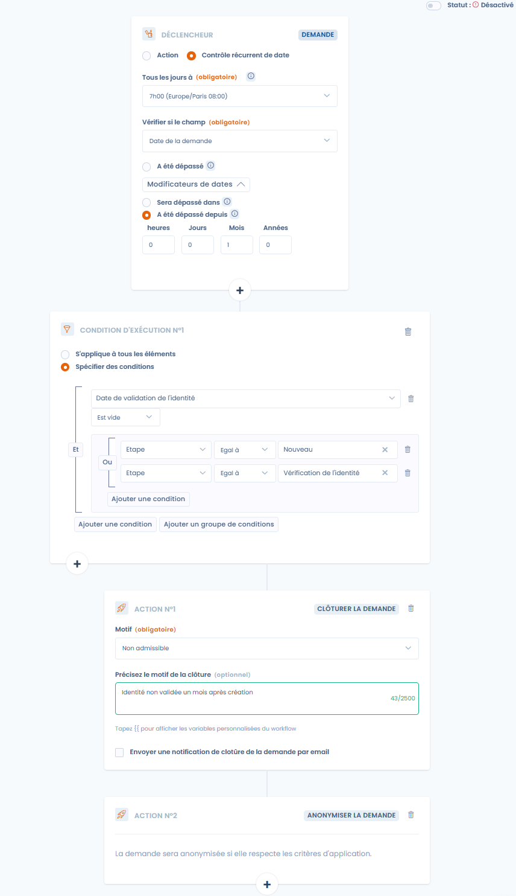

# Règles de workflows

## Le principe de fonctionnement

Les Règles de workflow dans Dastra sont un ensemble d'actions (notifications par e-mail, planification d'un audit, tâches et mises à jour de champs) qui sont exécutées lorsque certaines conditions sont réunies. Ces règles automatisent le processus d'envoi des notifications par e-mail, d'attribution des tâches et de mise à jour de certains champs d'un enregistrement lorsqu'une règle est déclenchée.

 (1).png>)

## Comment créer une règle de workflow dans Dastra ?

* Allez dans [la page de configuration des règles de workflows votre espace de travail](https://app.dastra.eu/workspace/0/settings/workflow-rules)
* Cliquez sur "Nouvelle règle de workflow"
* Choisissez un nom et le type d'entité concernée (Traitement, Violations...)
* Vous arrivez dans le designer de règles

### Définition du déclencheur

Vous pouvez déclencher une règle de workflow sur deux évènements :&#x20;

* Lors d'**une action sur une entité concernée** : création, modification, changement d'étape ou mise à la corbeille (seulement pour les objets pour lesquels la corbeille existe)

<figure><figcaption><p>Création d'un déclencheur par action</p></figcaption></figure>

* **Lorsqu'une date précise de l'entité est atteinte**. par exemple : envoyer une notification 10 jours après la date de publication. Dans ce cas, la date choisie sera vérifiée tous les jours à l'heure choisie pour le contrôle. Si la date a été dépassée, les actions seront déclenchées suite au contrôle. Dans le cas où un délai devait être ajouté ou retiré à la date des options supplémentaires sont disponibles en cliquant le modificateur de date (par exemple : 10 jours après la création ou 10 jours avant la date de revue)

<figure><figcaption><p>Création d'un déclencheur par date</p></figcaption></figure>

Un seul trigger peut être défini par règle de workflow.

A noter que vous pouvez choisir si le workflow peut s'exécuter plus d'une fois par entité. **Il est fortement recommandé** **d'exécuter les workflows une seule fois par entité**, car l'exécution d'un workflow plusieurs fois peut conduire assez facilement à des problèmes de répétition de création de tâches ou de doublons de notifications.

Les conditions peuvent être ajoutées à un groupe afin de permettre plus de&#x20;

### Définition de conditions

Vous pouvez configurer une ou plusieurs conditions d'exécution par règle.

Les conditions peuvent s'appliquer à l'ensemble des champs de l'objet (à l'exception des champs personnalisés de type "sélection multiple") et peuvent être assemblées au sein de groupes pour vous permettre de mettre en place l'ensemble des scénarios possibles (avec la possibilité de changer l'association "Et" ou "Ou").

<figure><figcaption><p>Ici l'action sera lancée si l'étape est "validation de l'identité" ou "nouveau" ET que la date de validation de l'email est remplie</p></figcaption></figure>

### Définition des actions

Pour ajouter une nouvelle action, cliquez sur le bouton "**Ajouter un action**" et choisissez le modèle que vous souhaitez mettre en place

Voici les **différents types d'actions** que vous pouvez déclencher :&#x20;

* Envoi d'une notification par email
* Mise à jour d'un champ de l'entité concernée
* Ajout d'un tag à l'entité
* Planification automatique d'un réponse à un questionnaire
* Définition de la personne assignée
* Création automatique d'une tâche

Pour les demandes d'exercices de droit, des actions supplémentaires sont disponibles :

* Clôturer la demande
* Mise à la corbeille de la demande
* Anonymisation de la demande (uniquement possible si la demande est clôturée)

Il est possible de chaîner les conditions. Vous pouvez ajouter plusieurs actions par condition en cliquant de nouveau sur "ajouter une action".


Exemple : envoyer une notification à plusieurs personnes lors de la création d'une tâche. Pour cela, sélectionner le déclencheur "taches" et selon les conditions de la tache (par exemple, l'ajout d'un tag), ajouter une action "notification"


### Variables personnalisées

\
Exemple\
Pour afficher une variable de type chaine de caractère (la référence d'un traitement)

Très souvent, dans les notifications personnalisées par exemple, il sera intéressant d'y injecter des informations provenant de l'objet qui est entré dans le workflow : le nom du traitement, sa date de publication... sont autant de variables que vous pourrez facilement injecter dans le texte de vos notifications grâce au système d'injection de variables.

En interne, Dastra utilise un moteur de templating basé sur [LiquidJS](https://shopify.github.io/liquid/basics/introduction/)

**Pour accéder aux différentes variables de l'objet du trigger, tapez "\{{",** cela affichera une liste de propositions de variables que vous pouvez injecter dans le contenu

```
{{ref}}
```

Pour afficher toutes les valeurs d'une variable de type tableau (les tags)

```



 {{ tag.label }}



```

Pour afficher uniquement la 1ere valeur d'une variable de type tableau : (1er approbateur d'un traitement)

```




{{accountable.displayName}}
```


### Exemples&#x20;

**Exemple de workflow basé sur une action**

Cet exemple permet de voir l'utilisation d'un workflow par action permettant de notifier les approbateurs d'un traitement lors d'un changement d'étape si l'étape courante est différente de "Nouveau"

<figure><figcaption></figcaption></figure>

**Exemple de workflow "complexe" basé sur une date :**

Cet exemple permet de voir l'utilisation d'un workflow par date permettant de nettoyer automatiquement les demandes de droits dont l'identité de l'utilisateur n'aurait pas été validé un mois après la création.

<figure><figcaption><p><strong>Tous les jours, fermer et anonymiser les demandes de droit dont l'identité du demandeur n'a pas été validée un mois après la création</strong></p></figcaption></figure>


## Tutoriel vidéo : les règles de workflow




