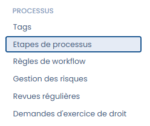

# Etapes de processus

## A quoi servent les étapes de processus ?

Les étapes de workflow (flux de travail en français) permettent de matérialiser un processus de réalisation en passant d'une étape à l'autre.&#x20;

Ainsi, vous pouvez décliner votre procédure de manière très opérationnelle en indiquant quelles sont les étapes à suivre directement dans Dastra.

## Comment personnaliser les étapes de workflow ?



Cliquez dans "Réglages" puis "Etapes de processus"&#x20;

<figure><figcaption></figcaption></figure>

Vous accéderez ainsi aux différentes étapes et statuts ("brouillon" ou "publié") de workflow disponible par processus. Personnalisez-les à votre convenance puis cliquez sur "enregistrer".

<figure><figcaption></figcaption></figure>

## Peut-on supprimer une étape de workflow ?

Pour supprimer les étapes, il faut cliquer sur la corbeille.&#x20;

Les éléments attachés à l'étape supprimés seront automatiquement rattachés à l'étape de premier niveau dans le même statut.&#x20;

Par exemple, si vous supprimez l'étape "En cours" dans les workflow de tâches&#x20;

<figure><figcaption></figcaption></figure>

Les objets attachés passeront à l'étape "Besoins d'infos"

<figure><figcaption></figcaption></figure>

