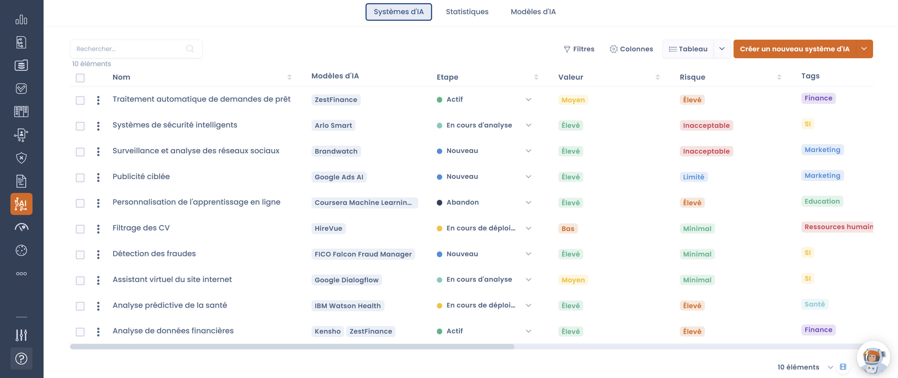

# Systèmes d'IA

### Introduction

Dans cette section, vous apprendrez à utiliser la fonctionnalité **Systèmes d'IA** de Dastra et à comprendre son intérêt pour votre organisation.

<figure><figcaption>
Interface du module
</figcaption></figure>

***

#### 🔹 Qu’est-ce qu’un système d’IA selon l’AI Act ?

Selon la loi sur l’intelligence artificielle (**AI Act**) de l’Union Européenne, un **système d’IA** est un logiciel développé à l’aide d’une ou plusieurs techniques d’intelligence artificielle qui traite des données – notamment personnelles – afin de produire des résultats tels que :

* Des **contenus** (textes, images, sons générés)
* Des **prédictions** (prédire un comportement d’achat, un risque de crédit)
* Des **recommandations** (produits, actions marketing, mesures de sécurité)
* Des **décisions automatisées** (acceptation ou refus d’un prêt, tri de candidatures)

Ces résultats influencent directement ou indirectement l’environnement physique ou numérique avec lequel le système interagit.

***

#### 🔹 Pourquoi tenir un registre des systèmes d’IA ?

**✅ 1. Répondre aux obligations réglementaires**

L’AI Act impose aux organisations de connaître, catégoriser et documenter leurs systèmes d’IA selon leur niveau de risque, en particulier pour :

* **Identifier les systèmes à risque élevé**, soumis à des obligations strictes (évaluation de conformité, gestion des risques, surveillance humaine, transparence).
* **Garantir la traçabilité** et démontrer leur conformité lors d’un contrôle ou audit par les autorités de régulation.
* **Anticiper les interdictions**, notamment pour les systèmes à risque inacceptable (ex. scoring social).

***

**✅ 2. Renforcer la gouvernance et la transparence**

Tenir un registre vous permet de :

* Centraliser l’information sur l’ensemble de vos systèmes d’IA.
* Identifier rapidement les parties prenantes responsables (Data Scientists, DPO, équipes métiers).
* Favoriser la **transparence interne**, essentielle pour la confiance des utilisateurs et des collaborateurs.
* Mettre à jour facilement la documentation en cas d’évolution du système (nouvelle version, nouveau dataset, changement d’usage).

***

**✅ 3. Sécuriser vos projets IA et prioriser vos investissements**

Le registre vous aide à :

* Évaluer la **valeur ajoutée métier** de chaque système d’IA (productivité, performance, réduction des risques).
* Mettre en balance cette valeur avec le **niveau de risque** associé pour prioriser vos projets.
* Décider de poursuivre, modifier ou abandonner un système si son rapport risque / bénéfice n’est pas favorable.

***

#### 🔹 La catégorisation des niveaux de risque

L’AI Act classe les systèmes d’IA en quatre catégories :

1. **Risque minimal** – Aucun impact significatif (ex. filtres anti-spam).
2. **Risque limité** – Obligation de transparence (ex. chatbots, deepfakes à des fins ludiques).
3. **Risque élevé** – Impact sur la sécurité ou les droits fondamentaux, nécessitant une conformité stricte (ex. recrutement automatisé, diagnostic médical assisté).
4. **Risque inacceptable** – Interdits (ex. scoring social généralisé, manipulation cognitive subliminale).

***

#### 🔹 À propos de la fonctionnalité Systèmes d’IA dans Dastra

💡 **Remarque :** Cette fonctionnalité est disponible uniquement si elle est incluse dans votre **plan d’abonnement**.

Dastra a conçu ce module pour vous permettre de :

* **Recenser** l’ensemble des systèmes d’IA utilisés ou développés au sein de votre organisation.
* **Évaluer leur niveau de risque** conformément à l’AI Act.
* **Documenter chaque système** avec ses actifs, datasets, modèles d’IA utilisés et parties prenantes impliquées.
* **Analyser la valeur métier** de chaque système afin d’aligner vos projets IA avec vos objectifs stratégiques.

***

#### 🔹 Ce que vous allez apprendre

En parcourant cette section, vous saurez :

* **Constituer un registre complet** de vos systèmes d’IA.
* **Créer et gérer un référentiel de modèles d’IA** utilisés dans vos projets.
* Documenter chaque système pour **démontrer votre conformité** lors d’audits.
* Intégrer l’évaluation des risques IA à vos processus de gouvernance des données et de conformité.

***

#### 🔹 L’intérêt stratégique pour votre organisation

Utiliser la fonctionnalité **Systèmes d’IA** dans Dastra vous permettra de :

✅ Réduire vos risques réglementaires et réputationnels\
✅ Renforcer la confiance de vos clients et partenaires\
✅ Structurer et accélérer vos initiatives IA\
✅ Favoriser l’adoption responsable et éthique de l’IA dans vos équipes

***

#### 🚀 **Prêt à commencer ?**

Accédez aux sections suivantes pour découvrir **pas à pas** comment utiliser chaque fonctionnalité du module et construire un registre IA conforme, utile et aligné sur vos enjeux stratégiques.

***

