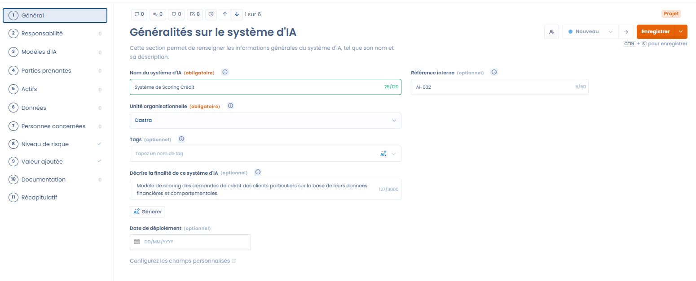
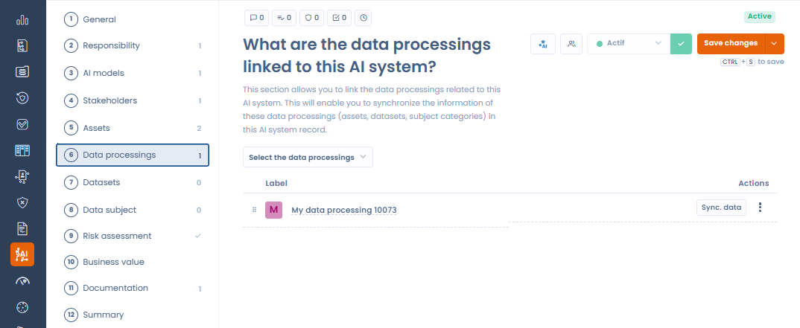
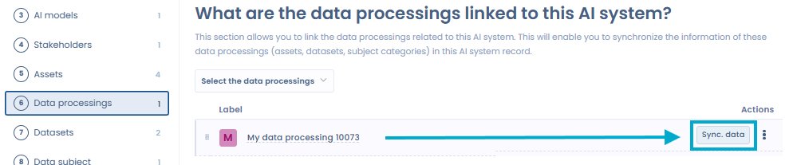

# Etablir un registre des Systèmes d'IA

Pour établir le registre des vos systèmes d'IA, vous avez deux options :

* Soit vous disposez déjà d'un registre que vous pourrez importer directement dans Dastra (dirigez vous vers la prochaine section : [**Importer vos systèmes d'IA**](importer-vos-systemes-dia.md))
* Soit vous n'en avez pas. Dans ce cas, il vous faudra le créer vous-même

## Créer un registre des systèmes d'IA

Pour ajouter un système d'IA, cliquez sur **"Créer un nouveau système d'IA"**. Une fenêtre vous propose trois modes de création :

<figure><figcaption>
Trois modes de création : génération par IA, modèle intégré ou fiche vierge
</figcaption></figure>

* **Générer avec l'IA** — L'assistant IA génère automatiquement une fiche complète à partir d'une courte description du système (nom, éditeur, URL…). Il utilise la navigation web pour enrichir les informations.
* **Modèle intégré** — Choisissez depuis la bibliothèque de systèmes d'IA Dastra ou depuis un autre workspace.
* **Personnalisé** — Créez une fiche vierge et renseignez chaque champ manuellement.

### Générer un système d'IA avec l'assistant IA

Sélectionnez **"Générer avec l'IA"**, puis décrivez le système à documenter (nom, éditeur…). Vous pouvez ajouter une pièce jointe ou une URL pour enrichir la génération.

<figure><figcaption>
Décrivez le système à générer — l'assistant utilise la navigation web pour compléter les informations
</figcaption></figure>

L'assistant produit une fiche pré-remplie (nom, description, type d'apprentissage, risque systémique, éditeur…) que vous pouvez relire et valider avant enregistrement.

<figure><figcaption>
La fiche générée est à relire avant validation — l'IA peut faire des erreurs
</figcaption></figure>


Les données générées automatiquement par l'IA peuvent contenir des erreurs. Relisez et corrigez la fiche proposée avant de l'enregistrer dans votre registre.


Une fois les informations obligatoires enregistrées, vous êtes redirigé sur un formulaire comprenant 11 étapes. Ce formulaire va vous permettre de détailler au maximum le système d'IA.

<figure><figcaption></figcaption></figure>

## Les 11 étapes du formulaire Système d'IA

Retrouvez ci-dessous les 11 étapes à compléter lors de la documentation d’un système d’IA.

***

### 1. Général

Saisissez les **informations de base** concernant le système d’IA :

* **Nom** du système
* **Brève description** de son objectif et de son fonctionnement

***

### 2. Responsabilités

Définissez votre **rôle et vos responsabilités** au regard du Règlement européen sur l’IA (AI Act). Un même acteur peut cumuler plusieurs responsabilités selon ses activités :

* **Fournisseur (Provider)**\
  Développe un système d’IA ou le fait développer, et le met sur le marché ou le met en service sous son nom ou sa marque, à titre onéreux ou gratuit.
* **Déployeur (Deployer / User)**\
  Utilise un système d’IA sous son autorité dans le cadre de ses activités professionnelles.
* **Importateur (Importer)**\
  Importe un système d’IA provenant d’un pays tiers en vue de sa mise sur le marché ou de sa mise en service dans l’UE.
* **Distributeur (Distributor)**\
  Met à disposition un système d’IA sur le marché de l’UE, sans être lui-même fournisseur ni importateur et sans en modifier les caractéristiques.
* **Mandataire (Représentant autorisé)**\
  Personne physique ou morale établie dans l’UE qui a reçu un mandat écrit d’un fournisseur établi hors UE pour agir en son nom concernant ses obligations au titre de l’AI Act.
* **Producteur de produit intégrant un système d’IA (Product Manufacturer)**\
  Si un système d’IA est intégré dans un produit soumis à une législation sectorielle (ex. dispositifs médicaux), le fabricant de ce produit est responsable du système d’IA comme fournisseur.

***

Assurez-vous d’identifier votre ou vos rôles avec précision pour déterminer vos **obligations de conformité** et responsabilités légales au titre de l’AI Act.

***

### 3. Modèles d’IA

Indiquez le ou les **modèles d’IA** utilisés pour traiter les données au sein de ce système.

> ℹ️ Pour en savoir plus, consultez le Référentiel des Modèles d’IA.

***

### 4. Parties prenantes

Identifiez les **parties prenantes impliquées** dans la mise en œuvre et la gestion de ce système d’IA, ainsi que leurs rôles (ex. Data Scientist, DPO, Product Owner).

***

### 5. Actifs

Ajoutez les **actifs soutenant ce système d’IA**, tels que :

* Composants d’infrastructure
* Outils logiciels
* APIs
* Ressources documentaires

***

### 6. Jeux de données

Listez les **jeux de données associés** à ce système d’IA. Indiquez leur utilisation parmi les phases suivantes :

* **Entraînement (Training)** : jeu de données utilisé pour **entraîner le modèle d’IA**, lui permettant d’apprendre des motifs, relations ou classifications à partir de données historiques.
* **Validation (Validation)** : jeu de données distinct utilisé pour **ajuster les paramètres du modèle et éviter le surapprentissage (overfitting)**. Il sert à évaluer la performance du modèle pen\* **Validation (Validation)** : jeu de données distinct utilisé pour **ajuster les paramètres du modèle et éviter le surapprentissage (overfitting)**.
* **Test (Testing)** : jeu de données indépendant utilisé pour **évaluer la performance finale** du modèle avant déploiement.
* **Inférence en production (Production inference)** : données traitées par le système d'IA lors de son utilisation en conditions réelles.

Assurez-vous de documenter clairement pour chaque jeu de données sa **finalité, sa composition et son lien avec ce système d'IA**.

***

### Traitements liés et synchronisation des données

L'onglet **Traitements** de la fiche système d'IA permet d'associer un ou plusieurs traitements de données du registre RGPD à ce système. Cette liaison garantit la cohérence entre votre registre des traitements et votre registre des systèmes d'IA.

<figure><figcaption>
L'onglet "Traitements" liste les traitements RGPD associés à ce système d'IA
</figcaption></figure>

#### Synchroniser les données d'un traitement

Pour chaque traitement lié, le bouton **"Sync. data"** permet d'importer automatiquement dans la fiche système d'IA les éléments du traitement sélectionné : actifs, jeux de données et catégories de personnes concernées.

<figure><figcaption>
Le bouton "Sync.