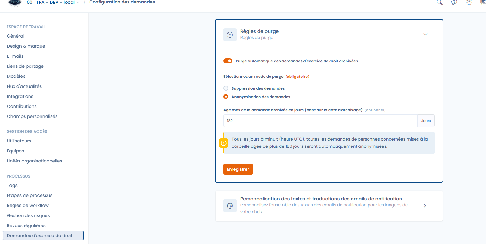

# Etablir un registre des Systèmes d'IA

Pour établir le registre des vos systèmes d'IA, vous avez deux options :

* Soit vous disposez déjà d'un registre que vous pourrez importer directement dans Dastra (dirigez vous vers la prochaine section : [**Importer vos systèmes d'IA**](etablir-un-registre-des-systemes-dia.md#importez-vos-systemes-dia))
* Soit vous n'en avez pas. Dans ce cas, il vous faudra le créer vous-même

## Importer vos systèmes d'IA

Si vous ne disposez pas déjà d'un registre de systèmes d'IA, passez directement à la section suivante : [Créer un registre des systèmes d'IA](etablir-un-registre-des-systemes-dia.md#creer-un-registre-des-systemes-dia).

Vous pouvez facilement télécharger votre registre existant directement dans Dastra. Cela vous évitera de tout remplir vous-même à la main.

Pour cela, accéder à la vue liste, intitulée "Systèmes d'IA". en haut à droite, ouvrez le menu déroulant à côté du bouton "Créer un nouveau système d'IA" puis cliquez sur "Importer". Une nouvelle page apparait, vous pouvez ajouter votre registre existant en bas de celle-ci.

<figure><figcaption></figcaption></figure>

Nous vous recommandons de suivre les étapes de la page [Importer vos données (Excel, Csv, JSON)](../generalites/importer-vos-donnees-excel-csv.md) pour plus de détails.

## Créer un registre des systèmes d'IA

Pour ajouter un système d'IA, cliquez d'abord sur "Créer un nouveau système d'IA". Une fenêtre apparait alors, vous devez y entrer le nom du système et l'assigner à une unité organisationnelle.

Une fois les informations obligatoires enregistrées, vous êtes redirigé sur un formulaire comprenant 10 étapes. Ce formulaire va vous permettre de détailler au maximum le système d'IA.

<figure><figcaption></figcaption></figure>

## Les 11 étapes du formulaire Système d'IA

Retrouvez ci-dessous les 11 étapes à compléter lors de la documentation d’un système d’IA.

***

### 1. Général

Saisissez les **informations de base** concernant le système d’IA :

* **Nom** du système
* **Brève description** de son objectif et de son fonctionnement

***

### 2. Responsabilités

Définissez votre **rôle et vos responsabilités** au regard du Règlement européen sur l’IA (AI Act). Un même acteur peut cumuler plusieurs responsabilités selon ses activités :

* **Fournisseur (Provider)**\
  Développe un système d’IA ou le fait développer, et le met sur le marché ou le met en service sous son nom ou sa marque, à titre onéreux ou gratuit.
* **Déployeur (Deployer / User)**\
  Utilise un système d’IA sous son autorité dans le cadre de ses activités professionnelles.
* **Importateur (Importer)**\
  Importe un système d’IA provenant d’un pays tiers en vue de sa mise sur le marché ou de sa mise en service dans l’UE.
* **Distributeur (Distributor)**\
  Met à disposition un système d’IA sur le marché de l’UE, sans être lui-même fournisseur ni importateur et sans en modifier les caractéristiques.
* **Mandataire (Représentant autorisé)**\
  Personne physique ou morale établie dans l’UE qui a reçu un mandat écrit d’un fournisseur établi hors UE pour agir en son nom concernant ses obligations au titre de l’AI Act.
* **Producteur de produit intégrant un système d’IA (Product Manufacturer)**\
  Si un système d’IA est intégré dans un produit soumis à une législation sectorielle (ex. dispositifs médicaux), le fabricant de ce produit est responsable du système d’IA comme fournisseur.

***

Assurez-vous d’identifier votre ou vos rôles avec précision pour déterminer vos **obligations de conformité** et responsabilités légales au titre de l’AI Act.

***

### 3. Modèles d’IA

Indiquez le ou les **modèles d’IA** utilisés pour traiter les données au sein de ce système.

> ℹ️ Pour en savoir plus, consultez le Référentiel des Modèles d’IA.

***

### 4. Parties prenantes

Identifiez les **parties prenantes impliquées** dans la mise en œuvre et la gestion de ce système d’IA, ainsi que leurs rôles (ex. Data Scientist, DPO, Product Owner).

***

### 5. Actifs

Ajoutez les **actifs soutenant ce système d’IA**, tels que :

* Composants d’infrastructure
* Outils logiciels
* APIs
* Ressources documentaires

***

### 6. Jeux de données

Listez les **jeux de données associés** à ce système d’IA. Indiquez leur utilisation parmi les phases suivantes :

* **Entraînement (Training)** : jeu de données utilisé pour **entraîner le modèle d’IA**, lui permettant d’apprendre des motifs, relations ou classifications à partir de données historiques.
* **Validation (Validation)** : jeu de données distinct utilisé pour **ajuster les paramètres du modèle et éviter le surapprentissage (overfitting)**. Il sert à évaluer la performance du modèle pendant l’entraînement et à guider les ajustements pour des résultats optimaux.
* **Test (Testing)** : autre jeu de données indépendant utilisé pour **évaluer la performance finale** du modèle entraîné et validé avant son déploiement. Il fournit une mesure impartiale des performances sur de nouvelles données non vues.
* **Inférence en production (Production inference)** : données traitées par le système d’IA **lors de son utilisation en conditions réelles**, où le modèle génère des prédictions, classifications ou décisions.

***

Assurez-vous de documenter clairement pour chaque jeu de données sa **finalité, sa composition et son lien avec ce système d’IA**, afin de garantir la transparence et la conformité.

***

### 7. Personnes concernées

Spécifiez les **catégories de personnes concernées** dont les données personnelles sont utilisées par le système d’IA (ex. clients, salariés, usagers).

***

### 8. Analyse des risques

Évaluez le **niveau de risque** associé au système d’IA, en fonction :

* Des types de données traitées
* Des traitements réalisés
* Des impacts potentiels sur les droits et libertés des personnes concernées

***

### 9. Valeur métier

Déterminez un **score de valeur métier** reflétant la contribution du système d’IA à votre organisation. Cela permet de :

* **Prioriser** les projets à forte valeur ajoutée
* Aligner les initiatives IA avec vos objectifs stratégiques

***

### 10. Documentation

Ajoutez les **documents et fiches d’information** pertinents, tels que :

* Notices d’information
* Guides techniques
* Évaluations de conformité (ex. AIPIA, DPIA)

***

### 11. Résumé

Consultez un **récapitulatif complet** de toutes les informations saisies pour ce système d’IA avant validation et enregistrement final.

***
