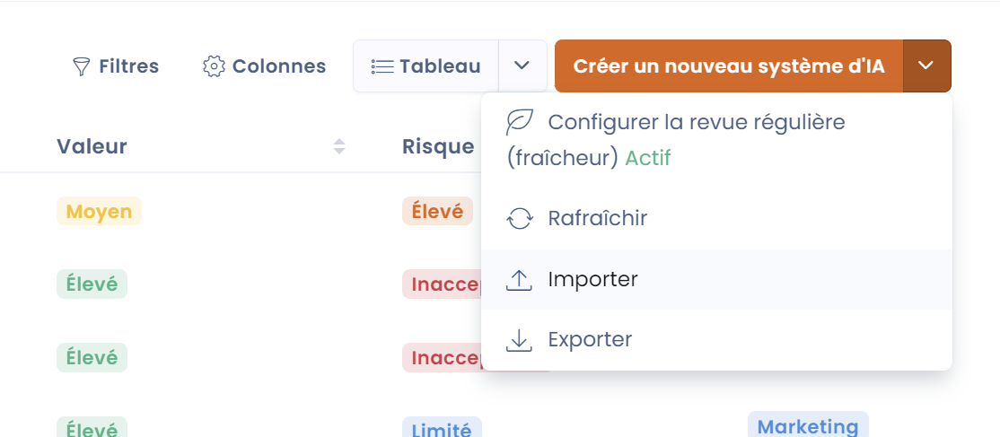

# Importer vos systèmes d'IA

Vous pouvez facilement télécharger votre registre existant directement dans Dastra. Cela vous évitera de tout remplir vous-même à la main.

Pour cela, accéder à la vue liste, intitulée "Systèmes d'IA". en haut à droite, ouvrez le menu déroulant à côté du bouton "Créer un nouveau système d'IA" puis cliquez sur "Importer". Une nouvelle page apparait, vous pouvez ajouter votre registre existant en bas de celle-ci.

<figure><figcaption></figcaption></figure>

Nous vous recommandons de suivre les étapes de la page [Importer vos données (Excel, Csv, JSON)](../generalites/importer-vos-donnees-excel-csv.md) pour plus de détails.


## Format d’import des systèmes d’IA dans Dastra

Ce guide décrit le format attendu pour le fichier CSV permettant d’importer des systèmes d’IA dans Dastra.

***

### Structure du fichier CSV

Le fichier doit contenir une ligne d’en-têtes correspondant aux colonnes décrites ci-dessous.\
Tous les champs sont optionnels sauf **Label**.

***

### Tableau des champs d’import

> 💡 **Important :** Les colonnes de type _Enum_ doivent utiliser strictement les valeurs indiquées dans la colonne “Valeurs autorisées”.

| **Colonne**                   | **Description**                   | **Type**             | **Contraintes**                                    | **Valeurs autorisées**            |
| ----------------------------- | --------------------------------- | -------------------- | -------------------------------------------------- | --------------------------------- |
| **Label**                     | Nom du système                    | String               | **Obligatoire**, 1–120 caractères                  | —                                 |
| **Ref**                       | Référence interne                 | String               | Optionnel, max. 50 caractères                      | —                                 |
| **Description**               | Description du système            | String               | Optionnel, max. 4000 caractères                    | —                                 |
| **State**                     | Statut du système                 | AiSystemState        | Optionnel                                          | Draft, Cancelled, Pending, Active |
| **RiskLevel**                 | Niveau de risque                  | AiSystemRiskLevel    | Optionnel                                          | Low, Medium, High, Unacceptable   |
| **RiskLevelJustification**    | Justification du niveau de risque | String               | Optionnel                                          | —                                 |
| **BenefitLevel**              | Niveau de valeur / utilité        | AiSystemBenefitLevel | Optionnel                                          | Low, Medium, High                 |
| **BenefitLevelJustification** | Justification de la valeur        | String               | Optionnel                                          | —                                 |
| **DateArchived**              | Date de mise à la corbeille       | DateTime             | Optionnel — Formats : `DD-MM-YYYY` ou `DD/MM/YYYY` | —                                 |
| **DateCreation**              | Date de création                  | DateTime             | Optionnel — même format                            | —                                 |
| **DateUpdate**                | Date de mise à jour               | DateTime             | Optionnel — même format                            | —                                 |
| **DateDeployment**            | Date de déploiement               | DateTime             | Optionnel — même format                            | —                                 |
| **DateRetirement**            | Date de retrait                   | DateTime             | Optionnel — même format                            | —                                 |
| **TransparencyNoticeDone**    | Notice de transparence fournie    | Boolean              | Optionnel                                          | true / false                      |
| **TransparencyNoticeHtml**    | Contenu HTML de la notice         | String               | Optionnel, max. 4000 caractères                    | —                                 |

***

### Exemple de ligne CSV

> ✨ _Voici un exemple complet d’une ligne bien formée :_

```
"ChatGPT interne","SYS-001","Modèle interne d’assistance documentaire","Active","Medium","Usage responsable mais risques modérés","High","Très forte valeur ajoutée pour les équipes","01/02/2024","15/01/2024","01/03/2024","20/03/2024","","false","<p>Cette IA est utilisée pour assister les employés dans la rédaction de documents internes.</p>"
```

***

### Modèle CSV prêt à l’emploi

> Vous pouvez _copier-coller ce modèle dans un fichier `.csv` vierge :_

```
Label,Ref,Description,State,RiskLevel,RiskLevelJustification,BenefitLevel,BenefitLevelJustification,Date
```

