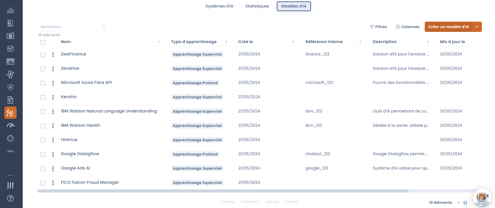
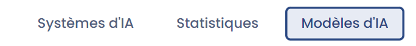
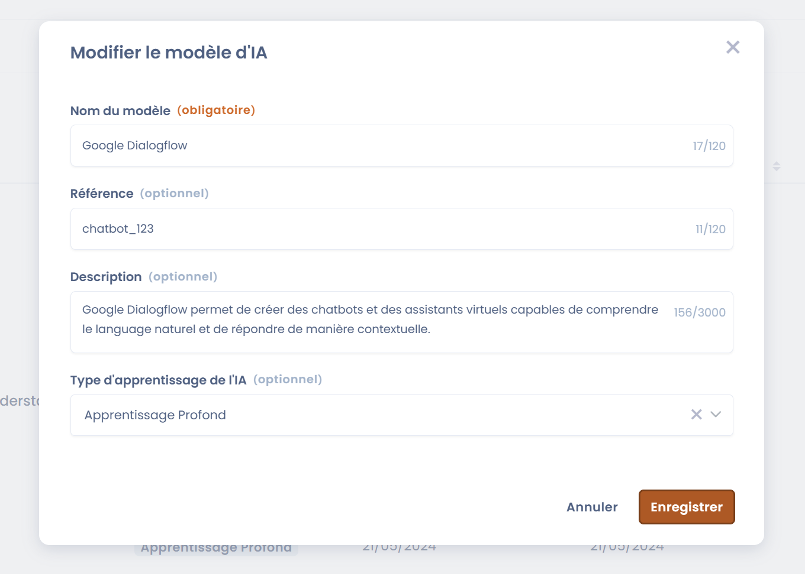
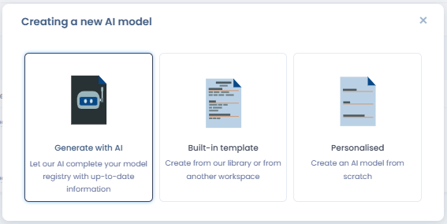
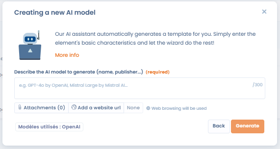
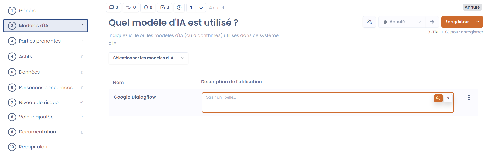

# Le référentiel des modèles d'IA

Pour chaque système d'IA que vous allez enregistrer, il faudra renseigner le ou les modèle(s) d'IA utilisé(s).

<figure><figcaption></figcaption></figure>

## Définition

Un modèle d'intelligence artificielle peut être défini comme un programme informatique conçu pour effectuer des tâches spécifiques en utilisant des techniques d'apprentissage automatique et d'analyse de données. Voici une définition plus détaillée :

* **Fondements** : Un modèle d'IA repose sur des algorithmes et des architectures spécifiques (comme les réseaux de neurones pour l'apprentissage profond) qui permettent d'apprendre à partir de données.
* **Apprentissage** : Il est formé en traitant de vastes ensembles de données pour identifier des modèles et des relations. Cela permet au modèle de faire des prédictions ou de générer du contenu en fonction des nouvelles données qu'il reçoit.
* **Fonctionnalité** : C'est le but dans lequel le modèle est utilisé. Par exemple : la génération d'image pour le modèle de MidJourney.
* **Utilisation** : Ces modèles sont déployés dans diverses applications allant des chatbots et assistants virtuels à l'analyse de données et la création de contenu, apportant des solutions avancées et automatisées dans divers domaines.

## Créer son référentiel dans Dastra

Pour créer un référentiel, dirigez vous vers l'onglet "Modèles d'IA".

<figure><figcaption></figcaption></figure>

Puis cliquez sur le bouton "Créer un modèle d'IA". Une fenêtre s'ouvre, vous pouvez y renseigner les informations demandées.

N'hésitez pas à bien détailler la partie description en y ajoutant les fonctionnalités et les informations dont vous disposez sur le modèle.

<figure><figcaption></figcaption></figure>

### Génération automatique avec l'assistant IA

Depuis la liste des modèles d'IA, il est possible de **générer automatiquement une fiche de modèle d'IA** grâce à l'assistant IA. Cette fonctionnalité permet de créer en quelques secondes des fiches pour les modèles les plus courants, à partir d'un simple nom de modèle ou d'une description.

Pour utiliser cette option  :

1. Cliquez sur le bouton **"Générer avec l'IA"** dans la liste des modèles d'IA.
2. Saisissez le nom ou une description du modèle cible.
3. Vérifiez et complétez la fiche générée avant de l'enregistrer.

Le contenu généré est une proposition — vérifiez et complétez les informations avant de valider.

<figure><figcaption></figcaption></figure>

<figure><figcaption></figcaption></figure>

<figure><figcaption></figcaption></figure>

## Liaison entre système et modèle

Pour lier un système d'IA à un modèle, il faut se rendre sur le système d'IA concerné. Dans la deuxième section, intitulée "Modèles d'IA", vous retrouvez un sélecteur dans lequel vous pouvez choisir un ou plusieurs modèle(s) parmi ceux que vous avez enregistré dans votre référentiel de modèles.

Sélectionnez les modèles concernés, puis renseignez le champs "description de l'utilisation". Celui-ci sert à expliquer comment le modèle est utilisé dans le cadre du système d'IA concerné.

<figure><figcaption>
Lier un modèle et un système d'IA
</figcaption></figure>
