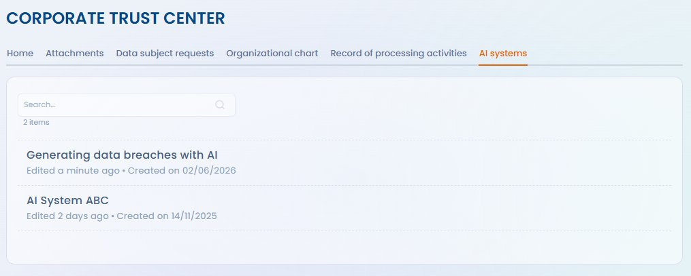

# Systèmes d'IA

Le Trust Center de Dastra vous permet d'exposer publiquement (ou de façon restreinte) les systèmes d'IA déclarés dans votre workspace. Cette fonctionnalité répond aux obligations de transparence de l'AI Act et renforce la confiance de vos clients, partenaires et personnes concernées.

***

## Activer l'onglet Systèmes d'IA

Dans la configuration de votre Trust Center, activez le module **Systèmes d'IA** depuis **Trust Center > Configuration > Systèmes d'IA**.

<figure><figcaption>
Cochez « AI systems » dans les fonctionnalités à afficher pour activer l'onglet sur le portail public
</figcaption></figure>

Une fois activé, un onglet dédié apparaît sur le portail public. Il liste les systèmes d'IA que vous avez choisi de rendre visibles.

<figure><figcaption>
Vue publique du Trust Center avec l'onglet « AI systems » listant les systèmes exposés
</figcaption></figure>

***

## Choisir les systèmes à publier

Par défaut, aucun système d'IA n'est publié. Pour chaque système déclaré dans le module Systèmes d'IA de Dastra, vous pouvez choisir de le rendre :

* **Visible** — il apparaît dans l'onglet du Trust Center
* **Masqué** — il reste interne, non affiché sur le portail

Cette granularité vous permet de publier uniquement les systèmes pertinents pour vos parties prenantes (ex. systèmes déployés en relation directe avec des clients ou des personnes concernées) tout en conservant les systèmes internes hors de la vue publique.

***

## Informations affichées

Pour chaque système d'IA publié, le Trust Center peut afficher :

* Le **nom** et la **description** du système
* Sa **finalité** et les **catégories de personnes concernées**
* Le **niveau de risque AI Act** (minimal, limité, haut risque, interdit)
* Les **coordonnées du responsable** ou du point de contact IA
* Les **mesures de transparence** mises en place

Les champs affichés dépendent des informations renseignées dans la fiche du système d'IA et des choix de configuration de votre Trust Center.

***

## Lien avec les obligations de l'AI Act

L'affichage des systèmes d'IA dans le Trust Center contribue à répondre aux obligations de transparence de l'AI Act (art. 13 et 50) pour les déployeurs de systèmes à risque limité et haut risque. Il ne se substitue pas aux notices d'information individuelles requises le cas échéant, mais constitue un point de référence centralisé pour vos parties prenantes.


Pour les systèmes classifiés **haut risque**, des obligations documentaires spécifiques s'appliquent (art. 13 AI Act). La publication dans le Trust Center complète, sans remplacer, la documentation technique requise par le règlement.

