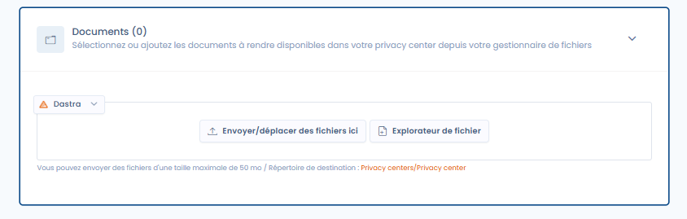

# Documents

**Activation de la fonctionnalité 'Documents' dans votre Trust center**

Pour activer la fonctionnalité '**Documents** dans votre Trust center, consultez la section de configuration générale qui permet d'activer ou de désactiver cette option. Une fois activée, une nouvelle page publique intitulée 'Documents' sera ajoutée à votre Trust center.

<figure><figcaption>
L'onglet de configuration des documents
</figcaption></figure>

#### Ajouter des documents à votre Trust center

Ajoutez des fichiers dans cet onglet (en les envoyant ou en les sélectionnant dans vos fichiers existants de la gestion documentaire)  afin de les mettre à disposition publiquement dans l'onglet documents de votre Trust center (pour consultation et téléchargement).

[Plus d'information sur la gestion des documents dans Dastra.](../../gestion-de-documents-ged/)
