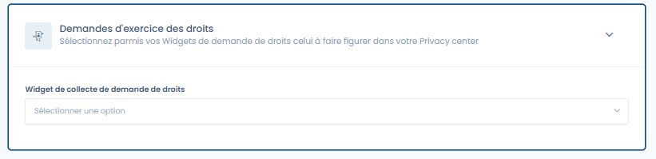

# Exercice des droits

**Activation de la fonctionnalité 'Exercice des droits' dans votre Trust center**

Pour activer la fonctionnalité '**Exercice des droits**' dans votre Trust center, consultez la section de configuration générale qui permet d'activer ou de désactiver cette option. Une fois activée, une nouvelle page publique intitulée 'Exercice des droits' sera ajoutée à votre Trust center.

<figure><figcaption>
L'onglet de configuration de la fonctionnalité Exercice des droits dans votre Trust center
</figcaption></figure>

#### Prérequis

Afin de pouvoir afficher un widget d'exercice des droits dans votre Trust center, vous devez disposer du module 'Exercice des droits' dans votre abonnement et avoir au préalable [configuré et publié un widget de collect](../../gerer-les-exercices-des-droits/implementez-un-widget-dexercice-des-droits.md)[e](../../gerer-les-exercices-des-droits/implementez-un-widget-dexercice-des-droits.md).

**Widget de collecte de demande de droits**

Ce champ vous permet de sélectionner le formulaire de collecte de demandes à afficher dans votre Trust center. A noter qu'il n'est possible d'affiche qu'un seul formulaire de collecte par Trust center.

