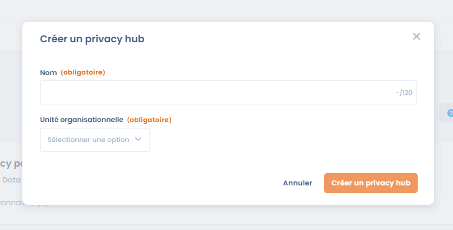
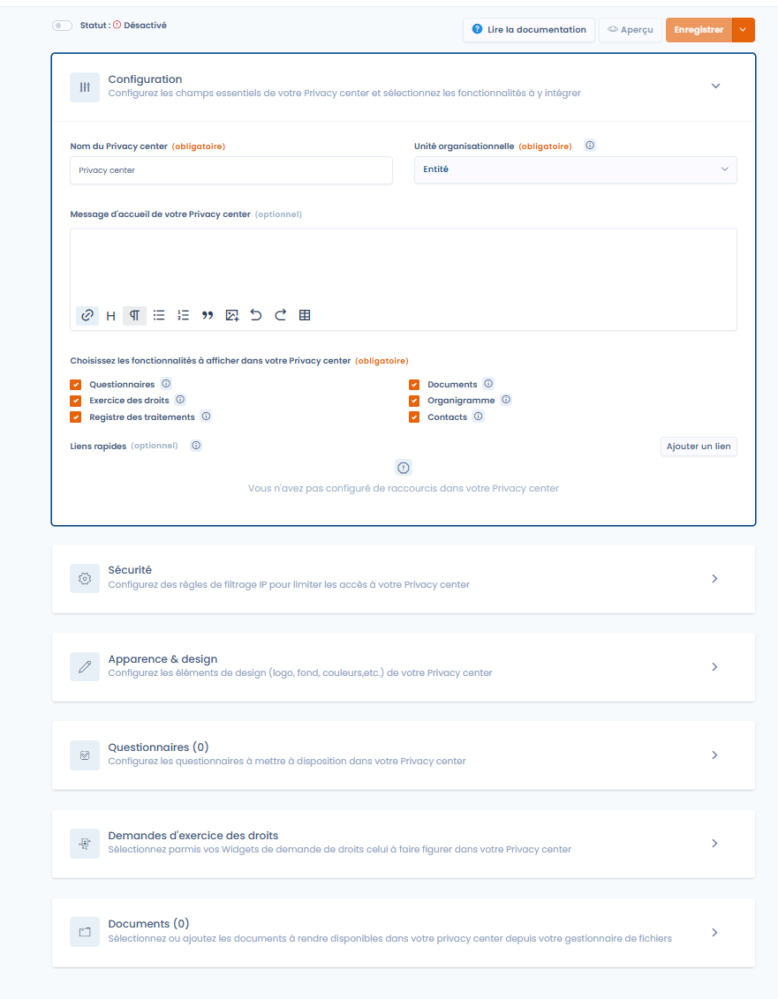

# Créer un Trust center

Vous pouvez créer un Trust center depuis la page d'accueil de la fonctionnalité Trust center en cliquant sur "Créer un Trust center". Cette option peut potentiellement être verrouillée si vous avez déjà atteint le quota de Trust center de votre plan.

<figure><figcaption>
Créer un privacy hub en cliquant sur 'créer un privacy-hub' 
</figcaption></figure>

Vous devez renseigner un nom et une unité organisationnelle afin de finaliser la création de votre Trust center

<figure><figcaption>
Créer un privacy-hub
</figcaption></figure>

Une fois le Trust center créé, vous êtes redirigé vers la page d'édition de votre Trust center

<figure><figcaption>
La page d'édition d'un Trust center
</figcaption></figure>
