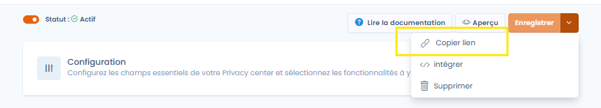
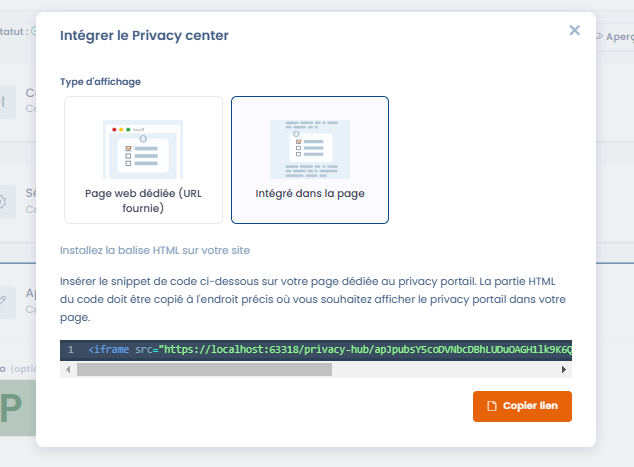

# Prévisualiser et partager votre Trust center

### Prévisualiser votre Trust center

Vous pouvez prévisualiser votre Trust center à tout moment en cliquant sur le bouton _**Apercu**_ situé en haut à droite de la page de configuration (dans la mesure ou votre Trust center est activé).&#x20;

Si vous effectuez des changements sur la page de configuration, il vous faudra rafraichir la page de prévisualisation (ou la réouvrir) pour prévisualiser vos modifications

### Partager votre Trust center

Une fois la configuration terminée, vous pouvez partager l'url de votre Trust center.

Pour ce faire, vous pouvez directement copier l'url de la fenêtre de prévisualisation, ou bien cliquer sur l'option _**Copier lien**_ du menu d'un Trust center

<figure><figcaption></figcaption></figure>

#### Intégrer votre Trust center dans une iframe

Vous pouvez également intégrer votre Trust center dans une iframe. Vous pouvez récupérer le code de l'iframe en cliquant sur l'option _**Intégrer**_ du menu de votre Trust center.

<figure><figcaption>
Intégrer le Trust center en mode iframe
</figcaption></figure>
