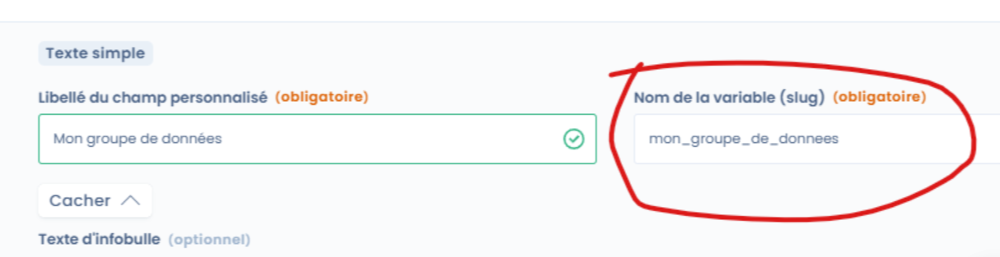

# Configuration API



### Configurer des API dans Dastra

API signifie _**application programming interface**_ ou « interface de programmation d’application » en français.

Les API permettent de connecter la plateforme Dastra a d'autres outils extérieurs.

Les possibilités sont multiples : connexion avec un logiciel CRM pour récupérer les parties prenantes de manière automatisée, synchronisation d'un outil de gestion des exercices des droits avec le module de Dastra etc.

Dastra repose sur le standard **API-Rest** et notamment les requêtes HTTP suivantes :

| URI                                                                   | GET                                                                                               | POST                                                                                                                                                                                                                                           | PUT                                                                                                                                                                                                | PATCH                                                                                                                                                                                                                  | DELETE                                                                                   |
| --------------------------------------------------------------------- | ------------------------------------------------------------------------------------------------- | ---------------------------------------------------------------------------------------------------------------------------------------------------------------------------------------------------------------------------------------------- | -------------------------------------------------------------------------------------------------------------------------------------------------------------------------------------------------- | ---------------------------------------------------------------------------------------------------------------------------------------------------------------------------------------------------------------------- | ---------------------------------------------------------------------------------------- |
| Ressource collection, telle que `http://api.exemple.com/collection/`  | _Récupère_ les URI des ressources membres de la ressource collection dans le corps de la réponse. | _Crée_ une ressource membre dans la ressource collection en utilisant les instructions du corps de la requête. L'URI de la ressource membre créée est _attribué automatiquement_ et retourné dans le champ d'en-tête _Location_ de la réponse. | _Remplace_ toutes les représentations des ressources membres de la ressource collection par la représentation dans le corps de la requête, ou _crée_ la ressource collection si elle n'existe pas. | _Met à jour_ toutes les représentations des ressources membres de la ressource collection en utilisant les instructions du corps de la requête, ou _crée éventuellement_ la ressource collection si elle n'existe pas. | _Supprime_ toutes les représentations des ressources membres de la ressource collection. |
| Ressource membre, telle que `http://api.exemple.com/collection/item3` | _Récupère_ une représentation de la ressource membre dans le corps de la réponse.                 | _Crée_ une ressource membre dans la ressource membre en utilisant les instructions du corps de la requête. L'URI de la ressource membre créée est _attribué automatiquement_ et retourné dans le champ d'en-tête _Location_ de la réponse.     | _Remplace_ toutes les représentations de la ressource membre, ou _crée_ la ressource membre si elle n'existe pas, par la représentation dans le corps de la requête.                               | _Met à jour_ toutes les représentations de la ressource membre, ou _crée éventuellement_ la ressource membre si elle n'existe pas, en utilisant les instructions du corps de la requête.                               | _Supprime_ toutes les représentations de la ressource membre.                            |

Source : [_wikipédia_](https://fr.wikipedia.org/wiki/Representational_state_transfer)

Avec Dastra, il est possible de configurer plusieurs API. La liste des API est accessible ici : [https://api.dastra.eu/swagger/index.html](https://api.dastra.eu/swagger/index.html)

### Limitations

Une limite de requête http est fixée à 500/min ou 10000/10min.

Les options de sécurité (notamment filtrage IP) ne s'appliquent pas aux API.

### Exposition des champs personnalisés dans l'API Dastra

Dans Dastra, il est possible d'exposer dans l'API [des champs personnalisés](../features/generalites/custom-fields.md) conçus depuis votre espace de travail Dastra.

Les champs personnalisés sont propre à chaque espace de travail. Pour les prendre en compte dans l'API Dastra, il faut d'abord définir le nom de leur variable dans la définition du champs personnalisé :

<figure><figcaption></figcaption></figure>


[custom-fields.md](../features/generalites/custom-fields.md)


La plupart des entités modifiables via l'API expose un champ nommé "**customFields**" que vous pouvez modifier.

Si vous définissez les champs avec les noms de variable suivants au sein de votre espace de travail :

* mon\_champ\_string : un champ "Texte"
* mon\_champ\_booleen : un champ "Case à coche"
* mon\_champ\_numeric : un champ "Nombre"
* mon\_champ\_checkbox : un champ "Cases à cocher"

Il sera possible de modifier ces informations de cette façon

```json
{ 
  "label": "Google Analytics 4",
  ...
  "customFields": {
     "mon_champ_string": "Valeur de mon champ",
     "mon_champ_booleen": true,
     "mon_champ_numeric": 1,
     "mon_champ_checkbox"!:["Pomme","Banane"],
     ...a
  }
}
```

### Le cas des tags

Pour exposer des tags dans l'API Dastra, il faut aller les chercher dans le endpoint tags avant de les ajouter : /v1/ws/{workspaceId}/Tags


**CONSEIL** : ne manipulez les API que si vous savez ce que vous faites !


Vous retrouvez l'interface de gestion des API dans Dastra à cette adresse : [https://app.dastra.eu/general-settings/api](https://app.dastra.eu/general-settings/api)
