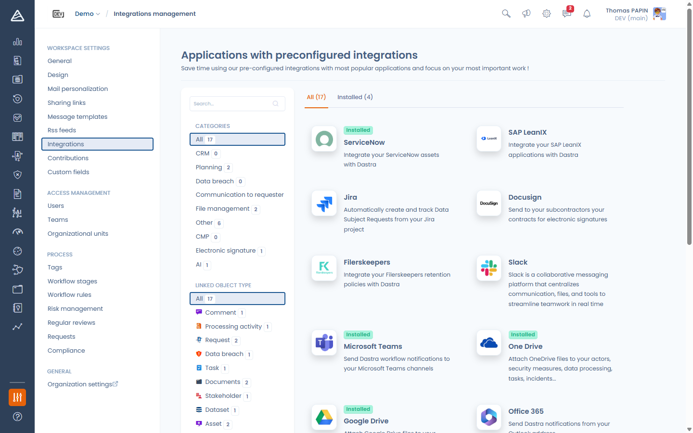
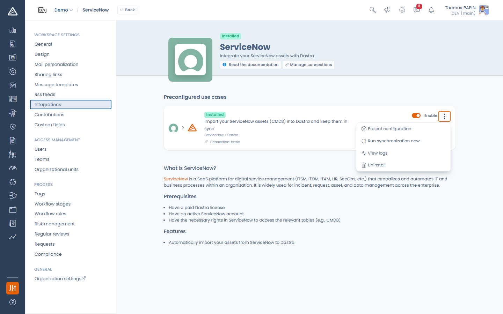
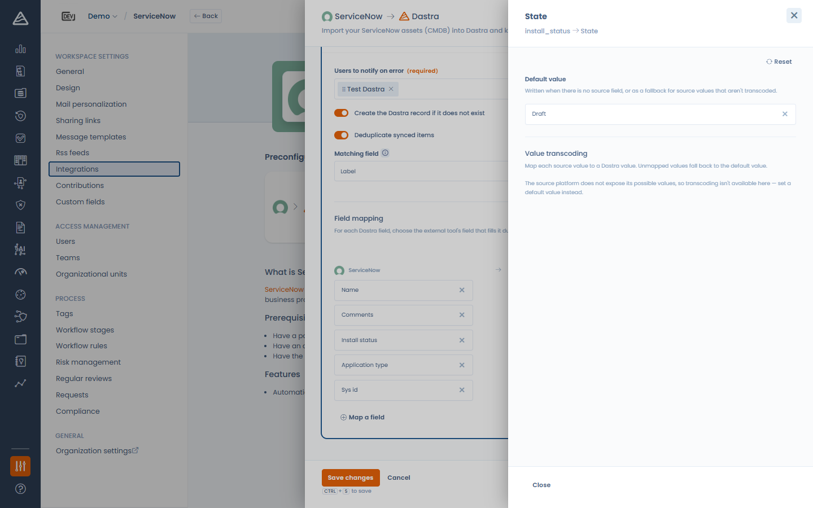

# Connexions, cas d'usage et mapping des champs

Cette page décrit les concepts communs à toutes les intégrations natives. Pour les instructions propres à chaque connecteur, consultez les pages dédiées (ServiceNow, SAP LeanIX, Jira, Microsoft Teams…).

### Le magasin d'intégrations

Ouvrez **Paramètres > Intégrations** dans votre workspace. Le catalogue liste toutes les intégrations disponibles, filtrables par catégorie et par objet Dastra ciblé, avec les onglets **Toutes / Installées**.

<!-- 📸 Capture : le catalogue des intégrations avec les filtres latéraux et les onglets Toutes/Installées -->

<figure><figcaption>
Le magasin d'intégrations
</figcaption></figure>

Cliquez sur une intégration pour ouvrir sa page : elle présente les **cas d'usage** disponibles (chacun avec son sens de circulation des données, ex. *ServiceNow > Dastra*), la description, et — pour les connecteurs qui s'authentifient auprès d'un outil externe — un bouton **Gérer les connexions**.

### Les connexions

Une connexion enregistre ce dont Dastra a besoin pour s'authentifier auprès de l'outil externe : soit des identifiants (identifiant/mot de passe ou clé d'API, stockés chiffrés par Dastra), soit une autorisation déléguée **OAuth** (aucun mot de passe stocké par Dastra).

Vous pouvez créer **plusieurs connexions vers le même outil** — par exemple une instance de production et une sandbox — et choisir celle utilisée par chaque cas d'usage.

Cliquez sur **Gérer les connexions** pour ouvrir le panneau des connexions. Pour chaque connexion vous voyez :

* son état de santé : **Connexion opérationnelle**, **En attente d'autorisation** (OAuth commencé mais non finalisé) ou **Connexion en erreur** (avec le dernier message d'erreur et le nombre d'erreurs),
* la méthode d'authentification,
* les cas d'usage qui l'utilisent.

Depuis ce panneau vous pouvez **Tester** une connexion (un test réussi réinitialise aussi son état d'erreur) ou la **supprimer**.

<!-- 📸 Capture : le panneau « Connexions » avec une connexion opérationnelle et le bouton Ajouter une connexion -->

<figure><figcaption>
Le panneau des connexions
</figcaption></figure>

Pour créer une connexion, cliquez sur **Ajouter une connexion** :

1. Donnez-lui un **Nom de la connexion** (ex. *Instance de production*) — facultatif, mais utile quand vous en avez plusieurs.
2. Choisissez la **Méthode d'authentification** quand le connecteur en propose plusieurs : **Basic (identifiants / clé d'API)** ou **OAuth**.
3. Renseignez les champs demandés par le connecteur (URL de l'instance, jeton d'API…).
4. Cliquez sur **Connecter** — ou **Enregistrer et se connecter** pour OAuth, qui vous redirige vers l'outil externe pour autoriser Dastra.

<!-- 📸 Capture : la modale de création de connexion (ex. SAP LeanIX ou ServiceNow) avec le nom, la méthode et les champs d'identification -->

<figure><figcaption>
Création d'une connexion
</figcaption></figure>

### Installer un cas d'usage

Cliquez sur **Ajouter l'intégration** sur la carte d'un cas d'usage. Le panneau d'installation vous guide en trois étapes maximum :

1. **Connexion** — sélectionnez une connexion existante ou créez-en une depuis la liste.
2. **Configuration** — les réglages propres au connecteur (options de synchronisation, mapping des champs…). Cette étape se déverrouille dès qu'une connexion valide est sélectionnée.
3. **Webhook** — uniquement pour les connecteurs qui reçoivent des événements de l'outil externe (ex. Jira). Cette étape se déverrouille après l'enregistrement de la configuration.

Une fois installé, la carte du cas d'usage vous donne :

* un interrupteur **Activer**,
* une entrée **Paramètres** pour rouvrir la configuration,
* **Lancer la synchronisation** (connecteurs d'import uniquement) pour déclencher une synchro immédiate,
* **Afficher les journaux** pour consulter les exécutions passées,
* **Désinstaller**.

<!-- 📸 Capture : une carte de cas d'usage installé avec l'interrupteur Activer et le menu « ... » ouvert -->

<figure><figcaption>
Un cas d'usage installé et ses actions
</figcaption></figure>


Désinstaller un cas d'usage efface les identifiants associés. Les actifs, demandes et autres enregistrements créés par l'intégration sont conservés — ils appartiennent à votre workspace.


### Le mapping des champs

Les cas d'usage d'import comportent une section **Mapping des champs** : pour chaque champ Dastra, choisissez le champ de l'outil externe qui l'alimente lors de la synchronisation. Un champ laissé sans source conserve son **comportement par défaut**.

* Les champs Dastra obligatoires sont marqués d'un astérisque rouge ; la configuration ne peut pas être enregistrée tant qu'un champ obligatoire n'a ni source ni valeur par défaut.
* **Mapper un champ** ajoute une ligne pour n'importe quel autre champ Dastra, y compris vos champs personnalisés.
* La liste des champs sources est récupérée en direct depuis l'outil externe quand c'est possible : vos attributs personnalisés côté source apparaissent donc aussi.

<!-- 📸 Capture : l'éditeur de mapping avec quelques lignes mappées, une ligne « Comportement par défaut » et le bouton « Mapper un champ » -->

<figure><figcaption>
L'éditeur de mapping des champs
</figcaption></figure>

#### Options avancées

Chaque ligne dispose d'un panneau **Avancé** avec deux options :

* **Valeur par défaut** — écrite lorsqu'il n'y a pas de champ source, ou en repli pour les valeurs sources non transcodées. Pour les champs de type date, vous pouvez choisir **Aujourd'hui** ou une date relative (ex. *dans 30 jours*), résolue au moment de la création de l'enregistrement.
* **Transcodage des valeurs** — pour les listes fermées (statuts, étapes de cycle de vie…) : associez chaque valeur source à une valeur Dastra. Les valeurs non mappées prennent la valeur par défaut.

<!-- 📸 Capture : le panneau Avancé d'un champ mappé montrant Valeur par défaut et Transcodage des valeurs -->

<figure><figcaption>
Valeur par défaut et transcodage des valeurs
</figcaption></figure>

#### Suggestions par IA

Si l'assistant IA est activé sur votre compte, le bouton **Suggérer par IA** propose un mapping complet (et chaque ligne a son propre bouton de suggestion). Les suggestions n'écrasent jamais les champs déjà mappés et vous sont toujours soumises pour relecture avant l'enregistrement.

### Synchronisation et journaux

* Les connecteurs d'import (ServiceNow, SAP LeanIX, Filerskeepers) synchronisent **quotidiennement** ; vous pouvez aussi déclencher une synchro à tout moment avec **Lancer la synchronisation**.
* **Afficher les journaux** montre chaque exécution avec son résultat et ses compteurs : éléments créés, mis à jour, marqués et en erreur, avec le détail de l'erreur le cas échéant.

<!-- 📸 Capture : le panneau des journaux d'intégration avec quelques exécutions et leurs compteurs -->

<figure><figcaption>
Les journaux d'intégration
</figcaption></figure>
