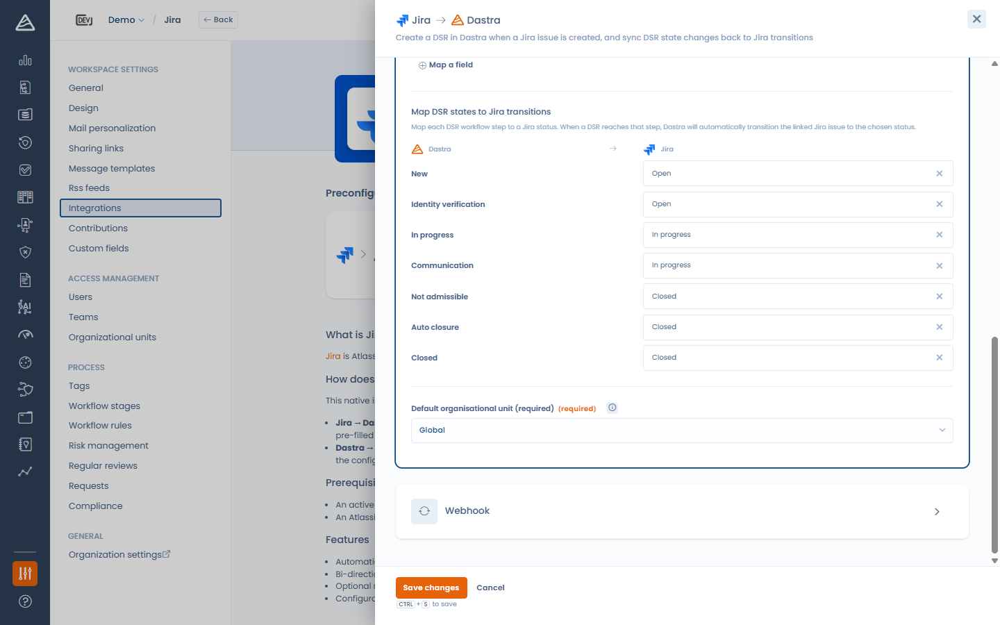

# Jira

### Que fait l'intégration ?

L'intégration Jira synchronise **les tickets Jira avec les demandes d'exercice de droits (DSR) Dastra**, dans les deux sens :

* **Jira → Dastra** : quand un ticket est créé ou mis à jour dans le projet Jira configuré, Dastra crée ou met à jour la demande correspondante, en remplissant ses champs selon votre mapping.
* **Dastra → Jira** : quand une demande atteint une étape de workflow, Dastra fait automatiquement passer le ticket Jira lié au statut que vous avez associé à cette étape.

### Prérequis

* Une instance Jira Cloud (ex. `https://votre-entreprise.atlassian.net`) et un projet à synchroniser.
* Selon la méthode d'authentification :
  * **Basic** — l'adresse e-mail d'un compte Jira et un [jeton d'API](https://id.atlassian.com/manage-profile/security/api-tokens) pour ce compte.
  * **OAuth** — aucun jeton à créer : vous vous connectez avec votre compte Atlassian et autorisez Dastra.


La méthode OAuth apparaît dans la liste **Méthode d'authentification** lorsqu'elle est disponible sur votre environnement Dastra. À défaut, utilisez un jeton d'API.


### Installation

1. Ouvrez **Paramètres > Intégrations** et sélectionnez **Jira**.
2. Sur le cas d'usage DSR, cliquez sur **Ajouter l'intégration**.
3. Ajoutez une connexion :
   * **Basic** : saisissez l'**URL de l'instance**, l'**E-mail** et le **Jeton d'API**, puis cliquez sur **Connecter**.
   * **OAuth** : saisissez l'**URL de l'instance**, puis cliquez sur **Enregistrer et se connecter** — vous êtes redirigé vers Atlassian pour autoriser Dastra.

<!-- 📸 Capture : la modale de connexion Jira montrant le sélecteur Méthode d'authentification avec Basic et OAuth -->

<figure><figcaption>
Connexion de Dastra à Jira
</figcaption></figure>

### Configuration

* **Projet Jira** — le projet à synchroniser.
* **Type de ticket** — le type de ticket qui représente une demande d'exercice de droits.
* **Mapping des champs** — associez les champs d'une demande Dastra aux champs Jira. Lorsqu'un ticket Jira crée ou met à jour une demande, la valeur Jira choisie remplit chaque champ. Les sources incluent les champs Jira standard (résumé, e-mail du rapporteur, description, statut) **et vos champs personnalisés Jira** ; les champs à valeurs fermées (statuts, listes de choix) peuvent être transcodés en valeurs Dastra dans le panneau **Avancé**.
* **Associer les états DSR aux transitions Jira** — associez chaque étape du workflow DSR à un statut Jira. Quand une demande atteint cette étape, Dastra effectue la transition du ticket lié. Laissez une étape sur **Aucune transition** pour l'ignorer.
* **Unité organisationnelle par défaut** (obligatoire) — l'unité affectée aux demandes créées par l'intégration.

<!-- 📸 Capture : le panneau de configuration Jira avec le projet, le type de ticket et le mapping des champs -->

<figure><figcaption>
Configuration du cas d'usage Jira
</figcaption></figure>


Le champ **Email** de la demande doit être mappé (ou recevoir une valeur par défaut) : il identifie la personne concernée. La configuration ne peut pas être enregistrée sans lui.


<!-- 📸 Capture : la section « Associer les états DSR aux transitions Jira » avec quelques étapes associées à des statuts Jira -->

<figure><figcaption>
Association des étapes de workflow DSR aux statuts Jira
</figcaption></figure>

### Webhook (Jira → Dastra)

Enregistrez d'abord la configuration — l'URL du webhook entrant devient disponible une fois l'intégration configurée. Ensuite, dans l'étape **Webhook**, deux options :

* **Enregistrement manuel** — copiez l'**URL du webhook** et, dans Jira, accédez à **Paramètres du projet > Automation** (ou **Webhooks**) et ajoutez un webhook pointant vers cette URL pour les événements *ticket créé* et *ticket mis à jour*.
* **Enregistrement automatique** — cliquez sur **Enregistrer le webhook dans Jira** et Dastra l'enregistre pour vous via l'API Jira. Cela nécessite la permission globale **Administrer Jira** sur le compte configuré. Vous pourrez le retirer plus tard avec **Supprimer le webhook**.

<!-- 📸 Capture : l'étape Webhook avec l'URL copiable et le bouton « Enregistrer le webhook dans Jira » -->

<figure><figcaption>
Enregistrement du webhook Jira
</figcaption></figure>

### Désinstallation

La désinstallation de l'intégration efface les identifiants stockés et retire le webhook enregistré dans Jira (lorsqu'il avait été enregistré automatiquement). Les demandes créées par l'intégration sont conservées.
