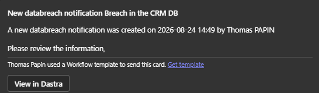
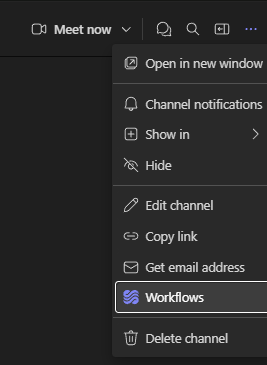
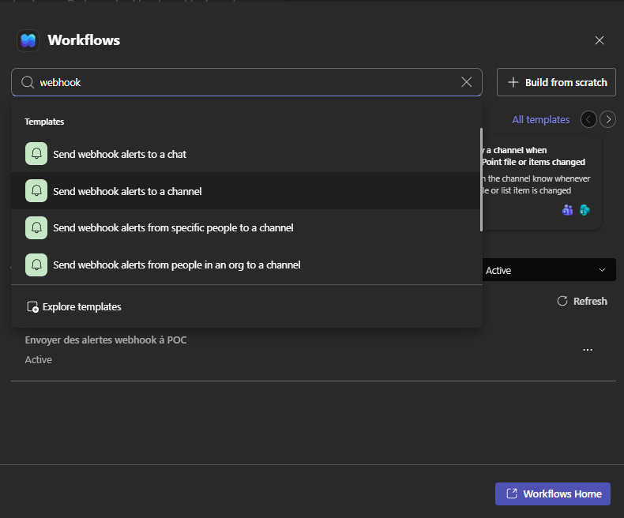
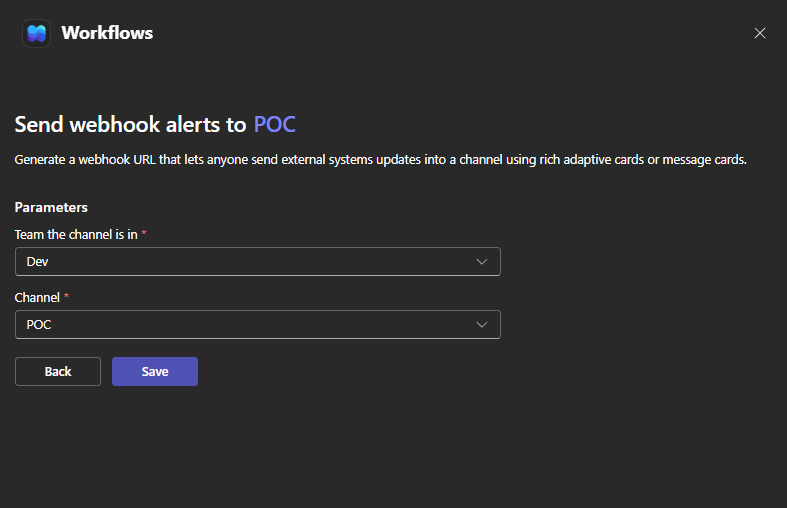
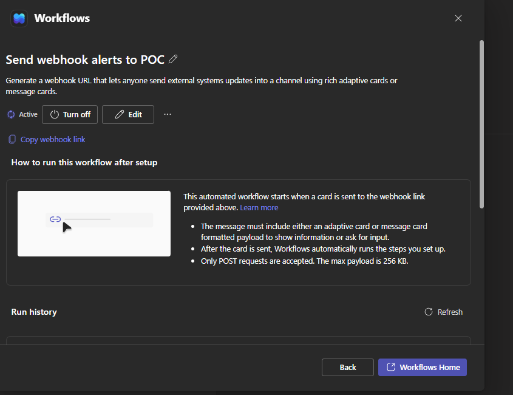

# Microsoft Teams

### Que fait l'intégration ?

L'intégration Microsoft Teams publie **les notifications de workflow Dastra sous forme de cartes dans un canal Microsoft Teams** : lorsqu'une règle de workflow se déclenche (une violation de données est créée, une demande change d'étape…), Dastra envoie une carte avec un titre, un message et, en option, un lien de retour vers l'enregistrement dans Dastra.

<!-- 📸 Capture : une carte de notification Dastra affichée dans un canal Teams, avec le bouton « Voir dans Dastra » -->

<figure><figcaption>
Une notification de workflow Dastra dans Teams
</figcaption></figure>

### Prérequis

Vous avez besoin d'un canal Microsoft Teams avec un **webhook entrant créé via l'application Workflows** (Power Automate) :

1. Dans Teams, ouvrez le canal et cliquez sur **⋯ > Workflows**.

<figure><figcaption>
L'entrée Workflows dans le menu du canal
</figcaption></figure>

2. Recherchez « webhook » et choisissez le modèle **Envoyer des alertes webhook à un canal** (*Send webhook alerts to a channel*).

<figure><figcaption>
Choix du modèle de webhook
</figcaption></figure>

3. Sélectionnez l'équipe et le canal, puis cliquez sur **Enregistrer**.

<figure><figcaption>
Rattachement du flux au canal
</figcaption></figure>

4. Sur l'écran de confirmation, cliquez sur **Copier le lien du webhook** — c'est l'URL à coller dans Dastra (de la forme `https://prod-XX.westeurope.logic.azure.com/workflows/...`).

<figure><figcaption>
Copie de l'URL du webhook
</figcaption></figure>


Microsoft a retiré les webhooks entrants Office 365 classiques (connecteurs de canal) en avril 2026. L'application Workflows est le remplacement proposé par Microsoft, et c'est sur elle que repose cette intégration.


### Installation

1. Dans Dastra, ouvrez **Paramètres > Intégrations** et sélectionnez **Microsoft Teams**.
2. Sur le cas d'usage de notifications de workflow, cliquez sur **Ajouter l'intégration**.
3. Ajoutez une connexion et collez l'**URL du webhook Workflows**.
4. Cliquez sur **Connecter**. Dastra publie immédiatement une carte de test (« *Notification de test Dastra* ») dans le canal pour valider l'URL.

<!-- 📸 Capture : la modale de connexion Microsoft Teams avec le champ URL du webhook Workflows -->

<figure><figcaption>
Installation de l'intégration Microsoft Teams
</figcaption></figure>


L'URL de webhook doit être un endpoint Power Automate en HTTPS (`*.logic.azure.com`, `*.azure-api.net` ou `*.api.powerplatform.com`). Les autres hôtes sont refusés.


Pour notifier **plusieurs canaux**, créez une connexion par canal (chaque webhook Workflows cible un seul canal).

### Envoyer des notifications depuis une règle de workflow

Une fois l'intégration installée et activée, le designer de règles de workflow propose une nouvelle action : **Envoyer une notification Teams**.

Configurez-la comme l'action de notification par e-mail :

* **Titre de la carte** — accepte les variables de fusion (ex. le nom de l'enregistrement).
* **Message** — texte riche avec variables de fusion.
* **Inclure un lien vers l'objet dans la carte** — ajoute un bouton **Voir dans Dastra** à la carte.

Il n'y a pas de destinataire à choisir : la carte est délivrée dans le canal associé au webhook.

<!-- 📸 Capture : le designer de règles de workflow avec le formulaire de l'action « Envoyer une notification Teams » (Titre de la carte, Message, interrupteur de lien) -->

<figure><figcaption>
L'action de workflow « Envoyer une notification Teams »
</figcaption></figure>


L'action Teams n'apparaît dans le sélecteur d'actions que lorsque l'intégration est installée et activée sur le workspace.


### Désinstallation

Lorsque vous désinstallez l'intégration Microsoft Teams, l'URL de webhook est effacée et toutes les règles de workflow qui utilisent l'action Teams sont **automatiquement désactivées** (pas supprimées), pour éviter que vos règles ne tombent en erreur. Réactivez-les après avoir réinstallé l'intégration.
