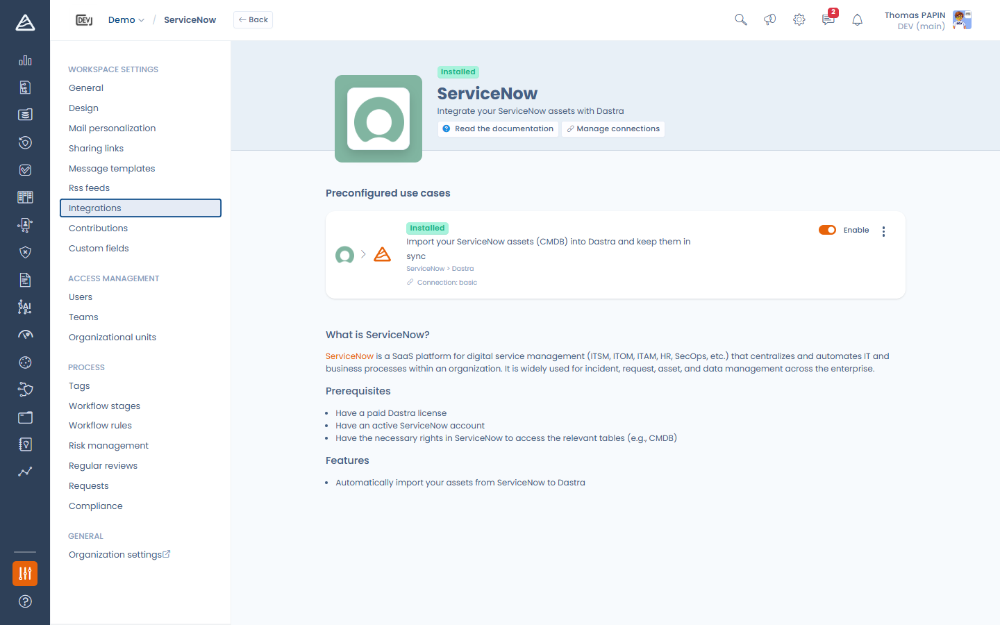

# Intégrations — Nouveautés de la 2.0.6

Dastra 2.0.6 apporte une refonte complète des intégrations natives, deux nouveaux connecteurs et une nouvelle capacité de streaming SIEM.

### Une expérience d'intégration repensée

Le magasin d'intégrations et le parcours d'installation ont été reconstruits autour de trois concepts : les **connexions**, les **cas d'usage** et le **mapping des champs**.

* Une **connexion** enregistre de quoi s'authentifier auprès de l'outil externe (identifiants ou autorisation OAuth). Vous pouvez créer plusieurs connexions vers le même outil (comptes ou environnements différents) et choisir celle utilisée par chaque cas d'usage.
* Chaque intégration expose un ou plusieurs **cas d'usage** (ex. *importer les applications comme actifs*, *synchroniser les demandes d'exercice de droits*). Les cas d'usage s'installent, s'activent, se configurent et se désinstallent indépendamment.
* Les cas d'usage d'import disposent d'un **éditeur de mapping des champs** : pour chaque champ Dastra, choisissez le champ externe qui l'alimente, définissez des valeurs par défaut, transcodez les valeurs sources en valeurs Dastra, et laissez l'assistant IA vous suggérer un mapping.

<!-- 📸 Capture : la page d'une intégration (ServiceNow ou SAP LeanIX) montrant les cartes de cas d'usage et le bouton « Gérer les connexions » -->

<figure><figcaption>
La nouvelle page d'intégration : les cas d'usage en haut, les connexions gérées à part
</figcaption></figure>

Le détail dans [Connexions, cas d'usage et mapping des champs](connexions-et-mapping-des-champs.md).

### Nouveau connecteur : Microsoft Teams

Envoyez les notifications de workflow Dastra dans vos canaux Microsoft Teams. Une fois l'intégration installée, une nouvelle action **Envoyer une notification Teams** est disponible dans le designer de règles de workflow : elle publie une carte (titre, message avec variables, lien de retour vers Dastra) dans le canal de votre choix.

En savoir plus : [Microsoft Teams](microsoft-teams.md).

### Nouveau connecteur : SAP LeanIX

Importez vos fact sheets **Application** SAP LeanIX dans le registre des actifs Dastra et gardez-les synchronisées quotidiennement. Le connecteur découvre votre data model LeanIX en direct — y compris vos attributs personnalisés — et arrive avec un mapping par défaut prêt à l'emploi (nom d'affichage, description, cycle de vie → état de l'application).

En savoir plus : [SAP LeanIX](sap-leanix.md).

### Nouveau : streaming SIEM

Diffusez les événements d'audit de sécurité de votre compte (connexions, changements de permissions, clés API, SSO, suppressions…) vers votre SIEM en temps réel — Splunk HEC (JSON), CEF ou Syslog RFC 5424 — ou exportez-les manuellement depuis la page des journaux d'audit dans les mêmes formats.

En savoir plus : [Streaming SIEM](../../features/settings/streaming-siem.md).


Le streaming SIEM est disponible avec le plan Enterprise et se configure par le propriétaire du compte dans le **Centre de sécurité**.


### Connecteurs améliorés

* **Jira** — l'installation passe par la page d'intégration unifiée : connexions nommées (jeton d'API, ou connexion Atlassian en OAuth lorsqu'elle est disponible), un écran de configuration unique avec mapping des champs (y compris les champs personnalisés Jira et le transcodage des valeurs), l'association des étapes de workflow DSR aux transitions Jira, et une étape webhook avec enregistrement en un clic dans Jira.
* **ServiceNow** — OAuth 2.0 est désormais pris en charge à côté de l'authentification Basic, et les options de synchronisation gagnent un dédoublonnage configurable (correspondance sur **Label** ou **Référence**) et la notification des erreurs.
* **Connecteurs d'import** (ServiceNow, SAP LeanIX, Filerskeepers) — l'action **Lancer la synchronisation** déclenche une synchro immédiate, et les journaux d'exécution (éléments créés / mis à jour / marqués) sont accessibles depuis la carte du cas d'usage.

### Renforcement de la sécurité

* Les identifiants et jetons des intégrations sont stockés chiffrés, ne sont jamais renvoyés par l'API, et sont effacés à la désinstallation d'une intégration ou à la suppression d'un workspace.
* Les flux OAuth valident désormais strictement les callbacks (validation du state, rattachement au workspace).
* Les endpoints de webhooks entrants sont soumis à une limitation de débit.
