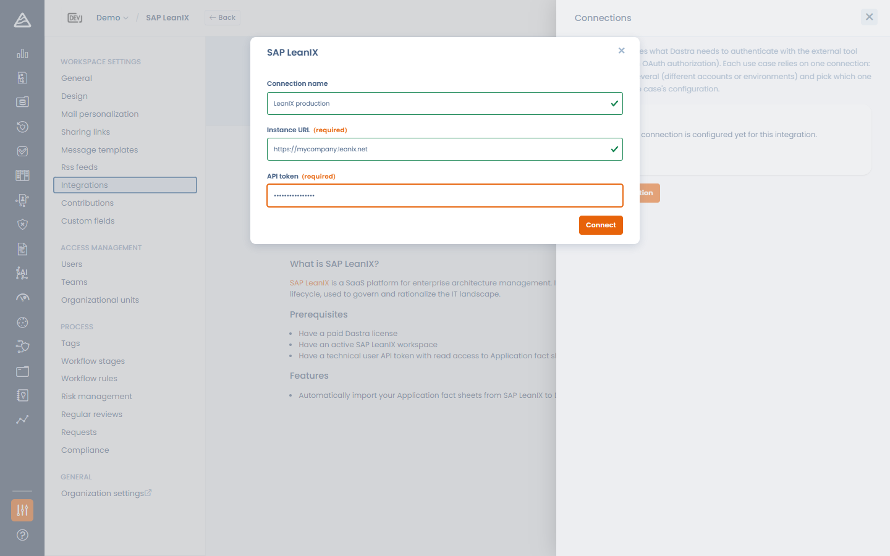
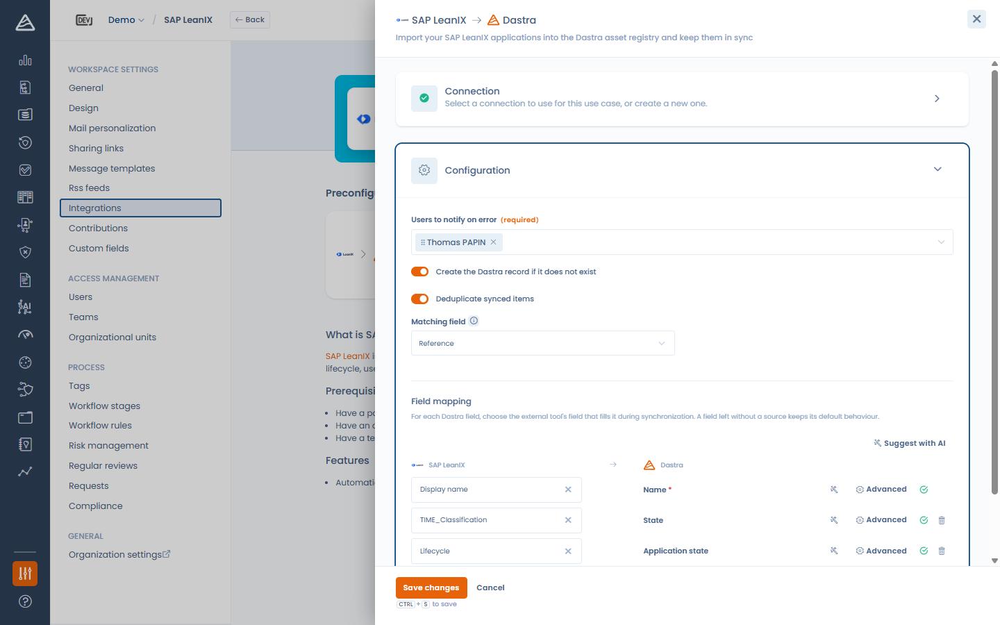

# SAP LeanIX

### Qu'est-ce que SAP LeanIX ?

[SAP LeanIX](https://www.leanix.net/) est une plateforme de gestion d'architecture d'entreprise : les organisations l'utilisent pour inventorier et gouverner leur patrimoine applicatif sous forme de *fact sheets*.

### Que fait l'intégration ?

L'intégration **importe vos fact sheets Application SAP LeanIX dans le registre des actifs Dastra et les garde synchronisées** :

* Chaque application LeanIX devient (ou met à jour) un **actif** de votre workspace.
* La synchronisation s'exécute **quotidiennement**, et peut être déclenchée manuellement à tout moment.
* Les actifs existants sont mis à jour, jamais dupliqués : la correspondance se fait sur l'identifiant de la fact sheet LeanIX (et en option sur un champ de votre choix, voir le dédoublonnage ci-dessous).
* L'intégration ne supprime jamais d'actifs — les applications qui disparaissent de LeanIX sont seulement marquées d'un tag.

### Prérequis

* L'**URL de votre instance** SAP LeanIX, ex. `https://votre-entreprise.leanix.net`.
* Un **jeton d'API** d'un *technical user* LeanIX, créé par votre administrateur LeanIX.


Utilisez l'URL racine de votre instance LeanIX, sans chemin de workspace (ex. `https://votre-entreprise.leanix.net`, et non `https://votre-entreprise.leanix.net/MonWorkspace`).


### Installation

1. Ouvrez **Paramètres > Intégrations** et sélectionnez **SAP LeanIX**.
2. Sur le cas d'usage d'import des applications, cliquez sur **Ajouter l'intégration**.
3. Ajoutez une connexion : saisissez un **Nom de la connexion**, l'**URL de l'instance** et le **Jeton d'API**, puis cliquez sur **Connecter**. Dastra valide le jeton auprès de votre instance.

<!-- 📸 Capture : la modale de connexion SAP LeanIX avec l'URL de l'instance et le jeton d'API -->

<figure><figcaption>
Connexion de Dastra à SAP LeanIX
</figcaption></figure>

### Configuration

L'étape de configuration vous permet de contrôler la façon dont les applications sont importées :

* **Utilisateurs à notifier en cas d'erreur** (obligatoire) — ces utilisateurs reçoivent un e-mail quand une synchronisation échoue.
* **Créer l'enregistrement Dastra s'il n'existe pas** — désactivé, seuls les actifs existants sont mis à jour.
* **Dédoublonner les éléments synchronisés** — fait correspondre les applications entrantes aux actifs existants via un **Champ de correspondance** (**Label** ou **Référence**) pour les mettre à jour au lieu de créer des doublons.
* **Mapping des champs** — choisissez quel champ LeanIX alimente chaque champ Dastra (voir [Connexions, cas d'usage et mapping des champs](connexions-et-mapping-des-champs.md)).

<!-- 📸 Capture : le panneau de configuration SAP LeanIX avec les options de synchronisation et le mapping des champs -->

<figure><figcaption>
Configuration de l'import SAP LeanIX
</figcaption></figure>

#### Spécificités du mapping

* La liste des champs sources est découverte **en direct depuis votre data model LeanIX** : vos attributs personnalisés sont disponibles, avec leurs valeurs possibles pour le transcodage.
* Le mapping par défaut fonctionne sans réglage : *Display name* → **Label**, *Description* → **Description**, et *Lifecycle* → **État de l'application** avec un transcodage pré-rempli (plan/phase-in → en développement, active → en production, phase-out/end-of-life → arrêté) que vous pouvez ajuster dans le panneau **Avancé**.
* Mappez n'importe quel champ LeanIX (par exemple un identifiant applicatif interne) vers la **Référence** de l'actif pour le rendre cherchable dans Dastra et utilisable comme champ de correspondance du dédoublonnage.

### Comment les données sont-elles synchronisées ?

La synchronisation s'exécute automatiquement **une fois par jour**. Vous pouvez aussi la déclencher à tout moment avec **Lancer la synchronisation** sur la carte du cas d'usage, et suivre les exécutions avec **Afficher les journaux** (compteurs créés / mis à jour / marqués, détail des erreurs).

#### Applications supprimées côté SAP LeanIX

Quand un actif précédemment importé n'existe plus dans LeanIX, Dastra ne le supprime **pas** : il ajoute le tag `To-delete-sap-leanix` pour que vous puissiez examiner et décider. Si la fact sheet réapparaît plus tard dans LeanIX, le tag est retiré automatiquement.

Quand le dédoublonnage trouve **plusieurs** actifs correspondant à une même application entrante, les candidats sont marqués `To-merge-sap-leanix` pour une décision de fusion manuelle.


Les actifs importés appartiennent à votre workspace : la désinstallation de l'intégration les conserve (avec leurs tags) intacts.

