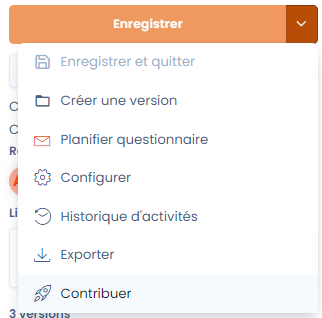
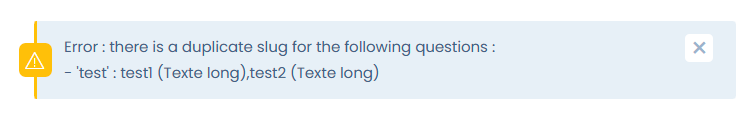
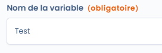
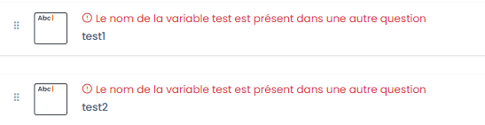
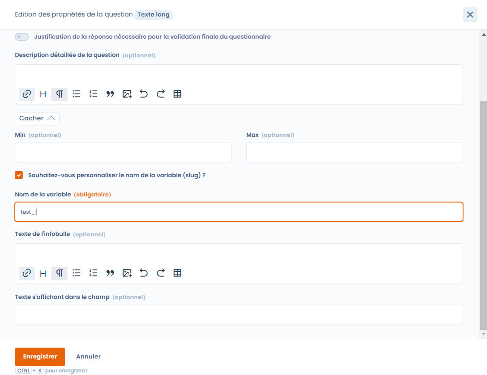
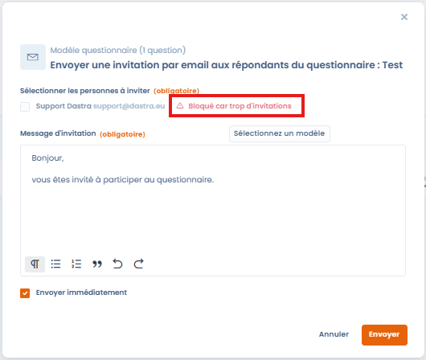
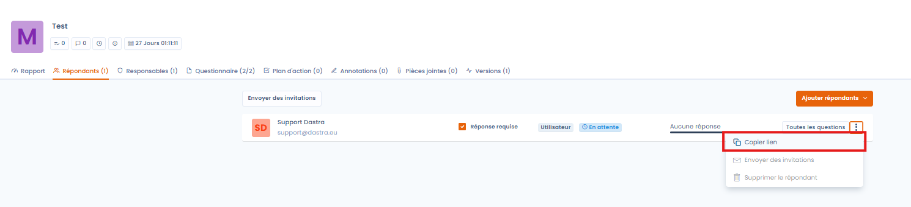
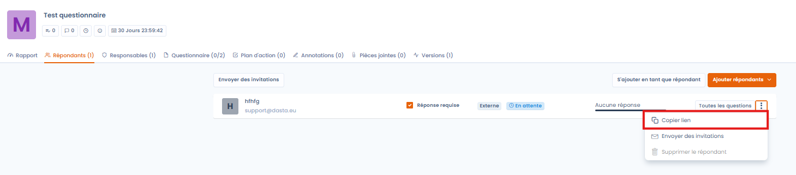

# Questions fréquentes

## Est ce que je peux faire un PIA sur plusieurs traitements ?

Une analyse d'impact sur la protection des données peut porter sur un traitement ou un ensemble de traitements similaires. **Une seule et même AIPD peut être utilisée pour évaluer plusieurs opérations de traitement similaires en termes de nature, de portée, de contexte, de finalités et de risques.**

Par exemple :

* des collectivités qui mettent chacune en place un système de vidéosurveillance similaire pourraient effectuer une seule analyse qui porterait sur ce système bien que celui-ci soit ultérieurement mis en œuvre par des responsables de traitements distincts ;
* un opérateur ferroviaire (responsable de traitement unique) pourrait effectuer une seule analyse d’impact sur le dispositif de la surveillance vidéo déployé dans plusieurs gares.

Dans Dastra, le modèle par défaut de PIA est rattaché à un seul traitement. **Il est possible de modifier le modèle que le PIA ne soit pas attaché à un traitement**. Dans ce cas, vous pouvez réaliser le PIA, l'exporter et le placer dans la documentation des traitements concernés.

## Peut-on mettre en place un modèle de mail automatiquement à la création d'un questionnaire ?

Vous pouvez créer un modèle de mail qui pourra être utilisé dans les invitations aux questionnaires. Il n'est pas possible de réaliser des actions automatisées via les workflow par exemple. En effet, les questionnaires ne peuvent pas être utilisés comme éléments déclencheurs.

## En tant que répondant externe, est-ce que je peux mettre des images dans les réponses ?

Non, ce n'est pas possible. Cette possibilité est offerte si vous êtes un répondant interne (utilisateur de Dastra).

## Est-il possible de suggérer automatiquement une tâche à partir de la réponse d'un questionnaire ?

Oui, c'est possible depuis le type de question "texte long" en cochant la case "Suggérer automatiquement une tâche(s) à partir de la réponse".

## Est-il possible de publier un modèle de questionnaire pour tous les utilisateurs Dastra ?

Oui, c'est possible depuis le modèle de questionnaire en cliquant sur "Contribuer" : 

<figure><figcaption></figcaption></figure>

## A quoi correspondent les couleurs dans les réponses aux questionnaires ?

Dans les sections du questionnaire, des couleurs sont associées aux icones des questions.

Voici la correspondance des couleurs :

| Couleur               | Image                                                                                                                       | Description                                                                             |
| --------------------- | --------------------------------------------------------------------------------------------------------------------------- | --------------------------------------------------------------------------------------- |
| Gris entouré de rouge |                                                  | Question obligatoire non répondue                                                       |
| Noir entouré de rouge |                                                      | Question obligatoire répondue                                                           |
| Gris                  |                                              | Question non obligatoire non répondue                                                   |
| Vert                  |                                                       | Toutes les questions de la section ont un réponse. Question non obligatoire répondue    |
| Vert entouré de rouge |  | Toutes les questions de la section ont un réponse. Question obligatoire répondue        |
| Noir                  |      | Question non obligatoire répondue. Il reste des questions sans réponse dans la section. |

### Que faire lorsque l'on rencontre le message d'erreur "Error : there is a duplicate slug for the following questions" lors de l'enregistrement d'un questionnaire ? 

<figure><figcaption></figcaption></figure>

\
Ce message signal qu'une ou plusieurs questions dans le questionnaire porte exactement le même "Nom de la variable" ce qui crée l'erreur.

<figure><figcaption></figcaption></figure>

Les questions ayant le même "Nom de la variable" sont identifiables grâce au message d'erreur "Le nom de la variable est présent dans une autre question" s'affichant au-dessus d'elles.

<figure><figcaption></figcaption></figure>

Pour résoudre ce problème, il faut donc modifier le "Nom de la variable" de chacune des questions ayant le même "Nom de la variable" de manière à la rendre unique pour chaque question, par exemple en ajoutant un \_ est un numéro incrémenté à la fin de chaque "Nom de la variable" .

<figure><figcaption></figcaption></figure>

Lorsque le questionnaire ne contiendra plus de "Nom de la variable" en doublon, il sera possible de l'enregistrer normalement. 

### Que faire lorsque l'on rencontre le message "Bloqué car trop d'invitations" lors de l'envoi d'invitations par email aux répondants du questionnaire ?

<figure><figcaption></figcaption></figure>

\
Ce message apparaît si 5 invitations par email ont déjà été envoyées à un répondant depuis le même questionnaire.\
\
Lorsque ce message apparait, vous pouvez encore inviter le répondant en lui transmettant le lien d'invitation au questionnaire disponible ici :

<figure><figcaption></figcaption></figure>

### Que faire lorsque je ne peux pas "Revoir et valider le questionnaire" alors que je suis bien responsable ?

Cela peut arriver lorsque le répondant n'a pas encore finalisé son questionnaire en cliquant sur le bouton "Finaliser" après y avoir répondu.\
\
Dans ce cas, en tant que responsable, vous avez la possibilité de vérifier où en est le questionnaire du côté du répondant en utilisant le lien d'accès du répondant disponible ici :

<figure><figcaption></figcaption></figure>

## Y a-t-il une limite sur le nombre de modèles de questionnaires ?

Oui, le nombre de modèles disponibles dépend de votre souscription. Ce quota est **partagé entre tous les espaces de travail** de votre organisation. La **corbeille des modèles compte dans ce quota** : les modèles supprimés mais non vidés de la corbeille occupent toujours un emplacement. Si vous atteignez la limite, videz la corbeille des modèles inutilisés depuis l'interface de gestion des modèles.

## Est-il possible de partager le lien d'accès d'un questionnaire avec plusieurs personnes ?

Oui. Lorsqu'un répondant reçoit un lien d'invitation par email, le **premier accès via ce lien ne nécessite pas de code PIN**. En revanche, si le répondant transfère le lien à un collègue, cette personne devra valider son accès via un **code PIN reçu par email**. Cette mécanique garantit la sécurité de l'accès tout en permettant la collaboration au sein d'une même équipe externe, sans qu'il soit nécessaire de créer un compte Dastra.

## Un répondant externe peut-il ajouter lui-même d'autres répondants ?

Non, seul le **responsable (owner) du questionnaire** peut ajouter de nouveaux répondants depuis l'interface Dastra. Si un répondant externe souhaite impliquer un collègue, deux options existent : le responsable peut ajouter directement la nouvelle adresse email depuis la gestion du questionnaire, ou le répondant peut partager son lien d'invitation — le collègue devra alors valider son accès par un code PIN reçu par email.

## Y a-t-il un rappel automatique lorsqu'un questionnaire est en attente de validation ?

Aujourd'hui, le responsable reçoit une **notification** (dans Dastra et par email) lors de la finalisation du questionnaire par le répondant, mais il n'existe pas de système de relance automatique périodique. Pour ne manquer aucun questionnaire en attente, deux alternatives existent : consulter régulièrement la vue **"Mes réponses"** dans le module Questionnaires, ou configurer une **règle de workflow** pour automatiser l'envoi d'un questionnaire ou d'une notification à intervalles réguliers.

## Les questions à sélection dynamique nécessitent-elles des droits particuliers pour les répondants ?

Oui. Les types de questions **"Sélection dynamique simple"** et **"Sélection dynamique multiple"** affichent des listes d'objets issus directement de Dastra (actifs, traitements, parties prenantes, etc.). Pour que cette liste s'affiche, le répondant doit disposer des **droits de lecture** sur les objets correspondants dans Dastra. Un répondant externe sans compte Dastra ou sans les bonnes permissions ne pourra pas voir la liste.
