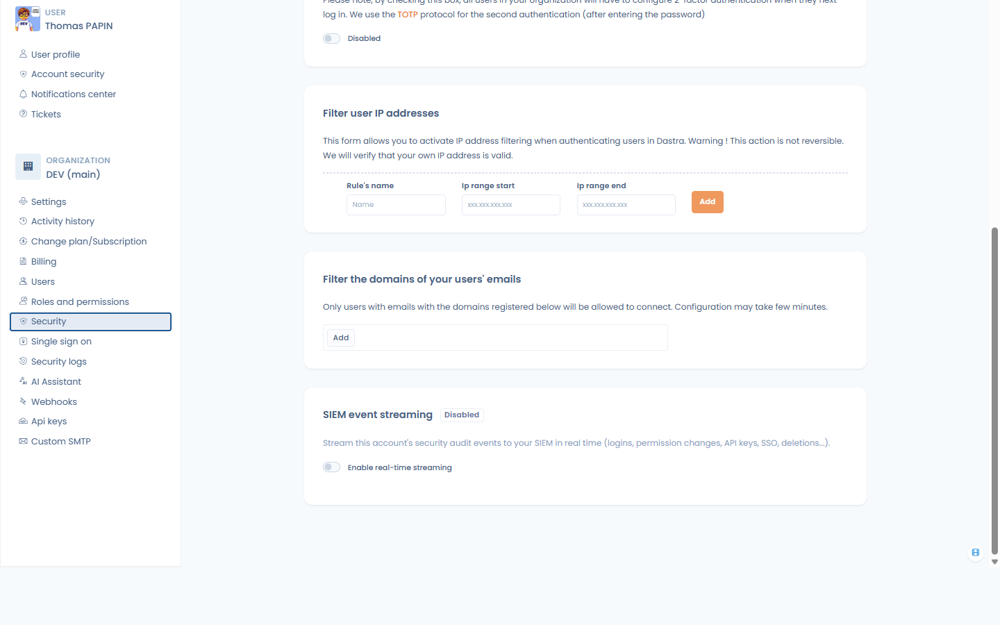
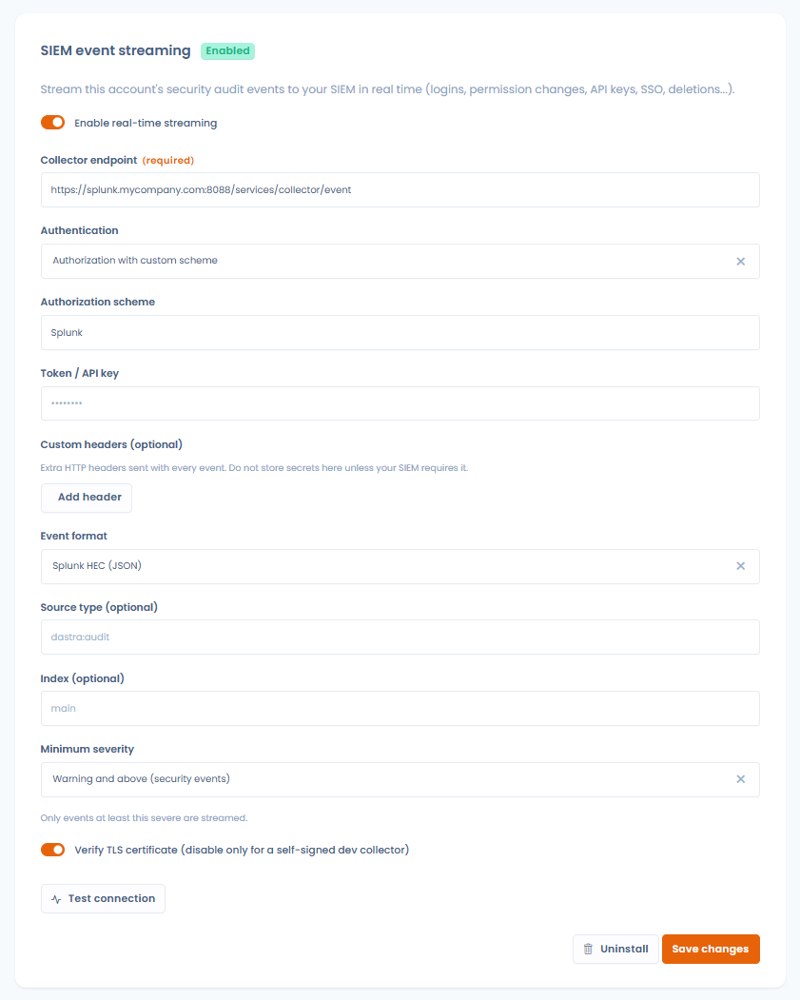

# Streaming SIEM

### Qu'est-ce que c'est ?

Le streaming SIEM diffuse **les événements d'audit de sécurité de votre compte Dastra vers votre SIEM en temps réel** : connexions, changements de permissions, clés API, changements MFA et SSO, suppressions d'utilisateurs et de workspaces… Tous les événements d'audit du compte sont diffusés, pour que votre équipe sécurité dispose de la piste complète dans l'outil qu'elle supervise déjà (Splunk, Sentinel, Sumo Logic, QRadar…).

Indépendamment du streaming, les journaux d'audit peuvent aussi être **exportés manuellement** aux formats SIEM — voir [Export manuel](#export-manuel-depuis-les-journaux-daudit) ci-dessous.

### Prérequis

* Le **plan Enterprise** (fonctionnalité Sécurité avancée).
* Être **propriétaire** du compte : la configuration se trouve dans le **Centre de sécurité**, en bas de la page **Sécurité** (section **Streaming d'événements SIEM**).
* Côté SIEM : un endpoint de collecteur d'événements HTTP joignable en HTTPS (ex. un endpoint Splunk HEC) et son jeton ou sa clé API.

<!-- 📸 Capture : la page Centre de sécurité > Sécurité, défilée jusqu'à la section Streaming d'événements SIEM -->

<figure><figcaption>
La section Streaming d'événements SIEM, dans Centre de sécurité > Sécurité
</figcaption></figure>

### Configuration

Remplissez le formulaire puis cliquez sur **Enregistrer** :

* **Endpoint du collecteur** (obligatoire) — l'URL HTTP(S) de votre collecteur SIEM, ex. `https://collector.example.com/services/collector/event` pour Splunk HEC.
* **Authentification** — la façon dont le jeton est envoyé avec chaque événement :
  * **Bearer** — `Authorization: Bearer <jeton>` (par défaut),
  * **API Key** — `Authorization: ApiKey <jeton>`,
  * **Authorization avec schéma personnalisé** — `Authorization: <schéma> <jeton>`, où vous renseignez le mot du **Schéma d'autorisation** (ex. `Splunk` pour une entrée Splunk HEC, `Api-Token` pour Dynatrace),
  * **Custom header** — le jeton est envoyé dans l'en-tête que vous nommez dans **Nom de l'en-tête** (ex. `X-API-Key`),
  * **None** — aucun en-tête d'authentification (ex. quand le jeton fait partie de l'URL).
* **Jeton / clé API** — le jeton du collecteur. Il est stocké chiffré et n'est jamais réaffiché ; laissez le champ vide par la suite pour conserver l'actuel.
* **En-têtes personnalisés (optionnel)** — en-têtes HTTP supplémentaires envoyés avec chaque événement, sous forme de paires clé/valeur.
* **Format des événements** :
  * **Splunk HEC (JSON)** — l'enveloppe native du HTTP Event Collector de Splunk. Deux champs optionnels supplémentaires apparaissent : **Source type** (par défaut `dastra:audit`) et **Index**.
  * **Dynatrace (Log Monitoring v2)** — le format natif de l'API d'ingestion de logs Dynatrace.
  * **CEF (Common Event Format)** — pour ArcSight, Sumo Logic et la plupart des SIEM qui ingèrent du CEF.
  * **Syslog (RFC 5424)** — lignes syslog structurées.
* **Sévérité minimale** — le niveau le moins sévère encore transmis (par défaut : *Tous les événements*) : **Tous les événements**, **Notice et plus**, **Warning et plus (événements de sécurité)** ou **Error et plus**. Nous recommandons **Warning et plus** : vous conservez le signal pertinent pour la sécurité (échecs de connexion, changements de permissions et SSO/MFA, clés API, suppressions…) sans inonder votre SIEM d'activité courante. Ne choisissez *Tous les événements* que si votre SIEM doit ingérer la piste d'audit complète.
* **Vérifier le certificat TLS** — laissez-le activé ; ne le désactivez que pour un collecteur de développement auto-signé.

Activez ensuite **Activer le streaming temps réel**.


**Recettes courantes** — Splunk HEC : endpoint `https://<hôte>:8088/services/collector/event`, format *Splunk HEC (JSON)*, authentification *Bearer* (ou *Authorization avec schéma personnalisé* + `Splunk` pour les entrées HEC classiques). Dynatrace : endpoint `https://<environnement>.live.dynatrace.com/api/v2/logs/ingest`, format *Dynatrace (Log Monitoring v2)*, authentification *Authorization avec schéma personnalisé* + `Api-Token`.


<!-- 📸 Capture : le formulaire SIEM rempli avec un endpoint Splunk HEC, l'authentification Bearer et le sélecteur de format ouvert -->

<figure><figcaption>
Configuration du streaming SIEM
</figcaption></figure>

### Tester la connexion

**Tester la connexion** envoie un événement de test synthétique à votre collecteur avec les valeurs du formulaire et affiche le résultat (« Événement de test délivré avec succès », ou l'erreur HTTP renvoyée par le collecteur). Utilisez-le après chaque changement — le test ne nécessite pas que le streaming soit activé.


Le streaming s'applique à l'ensemble du compte (tous les workspaces). Il existe une configuration SIEM par compte.


### Qu'est-ce qui est envoyé au SIEM ?

Chaque événement d'audit est délivré individuellement, au fil de l'eau, avec le contenu suivant :

| Champ | Contenu |
| --- | --- |
| `id` | Identifiant unique de l'événement d'audit |
| `time` / `timestamp` | Date de l'événement (UTC) |
| `action` | Type d'événement, ex. `UserLogin`, `PermissionChange`, `ApiKeyAdded` |
| `message` | Description lisible |
| `objectType` / `objectId` | L'enregistrement concerné, le cas échéant |
| `severity` | Sévérité de type syslog (voir ci-dessous) |
| `outcome` | `success` ou `failure` |
| `actorId` / `actorName` / `actorEmail` | Qui a effectué l'action |
| `tenantId` / `workspaceId` / `workspaceName` / `areaId` | Où cela s'est produit |
| `url` | Lien profond vers l'enregistrement dans Dastra |

Les événements sensibles pour la sécurité sont remontés en sévérité indépendamment de leur priorité d'affichage dans Dastra : les échecs de connexion répétés sont envoyés en **Error** (avec `outcome: failure`) ; les changements de permissions, la création/suppression de clés API, les changements MFA et SSO, les révocations et suppressions d'utilisateurs et les suppressions de workspaces sont envoyés en **Warning**. C'est aussi sur cette sévérité que porte le réglage **Sévérité minimale** — *Warning et plus* (le réglage recommandé) restreint le flux à ces événements de sécurité.


Les événements contiennent le nom et l'adresse e-mail de l'auteur de l'action — les informations déjà affichées dans le journal d'audit Dastra. Aucun contenu d'enregistrement (données personnelles des personnes concernées, contenu de documents…) n'est diffusé.


### Export manuel depuis les journaux d'audit

Vous pouvez exporter la piste d'audit de sécurité à la demande, dans les mêmes formats, sans configurer le streaming :

1. Ouvrez **Centre de sécurité > Journaux de sécurité**.
2. Réglez les filtres (période, workspace…) selon vos besoins.
3. Ouvrez le menu **Exporter (SIEM)** à côté du bouton d'export habituel et choisissez **CEF (Common Event Format)**, **Syslog (RFC 5424)** ou **Splunk HEC (JSON)**.

Le fichier (`dastra-security-logs-<date>`) contient les événements d'audit correspondants, jusqu'à 100 000, prêts à être ingérés par votre SIEM.

Le même menu propose aussi **Configurer le streaming temps réel**, un raccourci vers la configuration du streaming décrite ci-dessus.

<!-- 📸 Capture : la page Journaux de sécurité avec le menu « Exporter (SIEM) » ouvert montrant les trois formats -->

<figure><figcaption>
Export SIEM ponctuel depuis les journaux de sécurité
</figcaption></figure>

### Dépannage

* **Échec du test : HTTP 401/403** — vérifiez le jeton et le schéma d'authentification attendu par votre collecteur (Splunk HEC attend le jeton tel que configuré sur l'entrée HEC ; certains collecteurs attendent un en-tête personnalisé).
* **Échec du test : erreur de certificat** — votre collecteur utilise un certificat que Dastra ne peut pas vérifier. Corrigez la chaîne de certificats ; ne désactivez **Vérifier le certificat TLS** que pour un collecteur de développement.
* **Aucun événement n'arrive** — vérifiez que **Activer le streaming temps réel** est bien activé, et consultez les journaux d'ingestion de votre collecteur. Utilisez **Tester la connexion** pour isoler la connectivité de la configuration.
