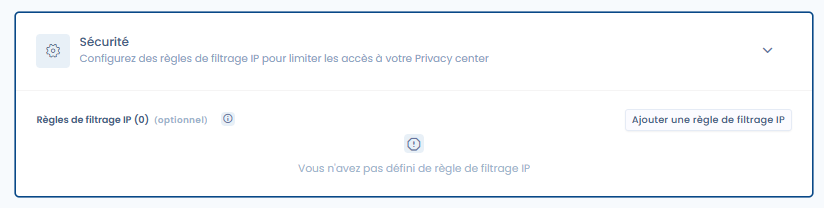

# Sécurité

L'onglet Sécurité regroupe trois types de configuration : la gestion des propriétaires du Trust center, le contrôle d'accès aux documents, et le filtrage par adresse IP.

## Propriétaires du Trust center

Il est possible de désigner **un ou plusieurs propriétaires** du Trust center. Les propriétaires reçoivent les demandes d'accès aux documents et peuvent les valider ou les refuser depuis un écran dédié dans le module Trust center.

<figure><figcaption>
Paramétrage des propriétaires et du contrôle d'accès dans l'onglet Sécurité
</figcaption></figure>

## Contrôle d'accès aux documents

Par défaut, une **confirmation d'accès** est requise pour consulter les documents publiés dans le Trust center. Ce comportement peut être configuré dans la section Sécurité.

Lorsque le contrôle d'accès est activé :

1. Les visiteurs voient la liste des documents disponibles, mais doivent soumettre une **demande d'accès** en fournissant leur adresse e-mail et le motif de leur demande.
2. Les propriétaires du Trust center reçoivent un e-mail et peuvent **gérer les demandes** depuis l'interface d'administration du module.
3. Si la demande est approuvée, le visiteur reçoit un e-mail contenant un **lien de téléchargement valide 30 jours**.


Si aucun propriétaire n'est désigné, les demandes d'accès ne peuvent pas être traitées. Assurez-vous de toujours avoir au moins un propriétaire actif.


## Filtrage par adresse IP

Cet onglet vous permet également de définir des règles pour limiter l'accès à votre Trust center à certaines plages d'IP. Par défaut, sans ajout de filtrage IP de votre part, votre Trust center sera accessible à toute personne disposant du lien d'accès, sous réserve que le Trust center soit activé.
