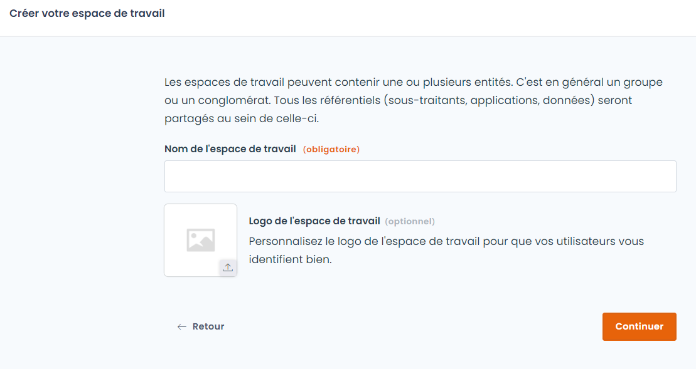
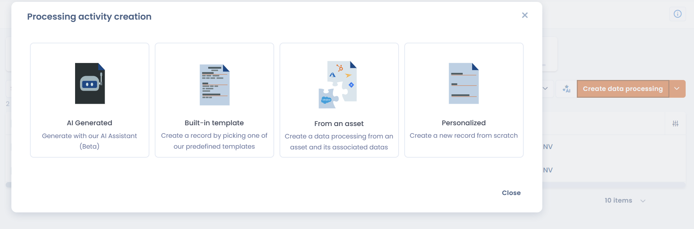
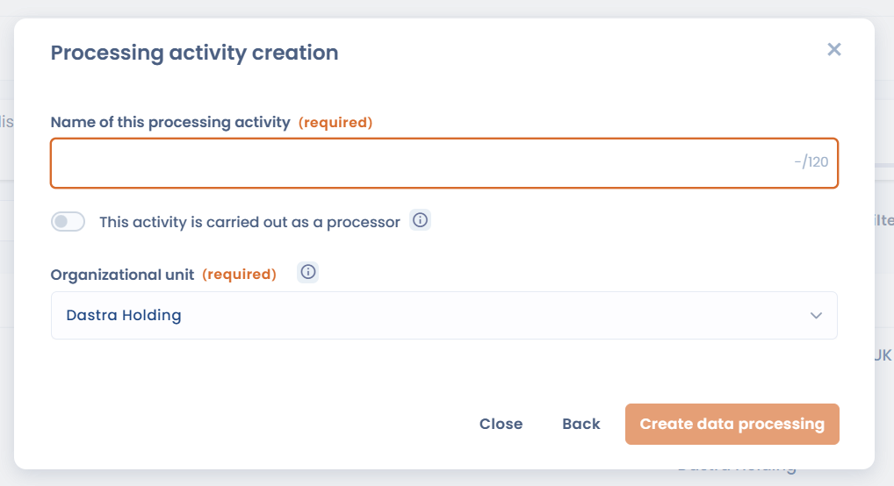

# 🚀 Démarrer en 5 minutes

Ce guide vous emmène de zéro à votre premier traitement documenté dans le registre Dastra. Pas de configuration avancée — juste l'essentiel pour démarrer.

***

## Étape 1 — Créer votre compte (1 min)

Rendez-vous sur [https://app.dastra.eu/signup](https://app.dastra.eu/signup) et créez un compte.


L'essai gratuit dure 30 jours, sans carte bleue. Vous avez accès à toutes les fonctionnalités.


***

## Étape 2 — Créer votre espace de travail (1 min)

Un **espace de travail** est l'environnement dans lequel vous allez documenter vos traitements. En général, un espace correspond à une entité légale ou un périmètre de conformité.

1. Après connexion, cliquez sur **"Nouvel espace de travail"**
2. Donnez-lui un nom (ex. : _Conformité RGPD – Société X_)
3. Cliquez sur **Continuer**

<figure><figcaption>
Donnez un nom à votre espace de travail
</figcaption></figure>


[espace-de-travail.md](setup/espace-de-travail.md)


***

## Étape 3 — Ajouter votre premier traitement (2 min)

Le cœur de Dastra est le **registre des traitements**. Commencez par documenter une activité simple — par exemple la gestion de votre messagerie professionnelle ou la paie.

1. Dans le menu gauche, cliquez sur **Registre des traitements**
2. Cliquez sur **Créer un traitement**
3. Choisissez le mode de création :

<figure><figcaption>
Choisissez comment créer votre premier traitement
</figcaption></figure>

| Mode                 | Description                                                                        |
| -------------------- | ---------------------------------------------------------------------------------- |
| **Généré par IA**    | L'assistant IA génère une fiche pré-remplie à partir d'un nom ou d'une description |
| **Modèle prédéfini** | Partez d'un modèle Dastra (paie, recrutement, vidéosurveillance…)                  |
| **Depuis un actif**  | Créez un traitement à partir d'un actif existant et de ses données associées       |
| **Personnalisé**     | Créez une fiche vierge de zéro                                                     |

Pour démarrer rapidement, choisissez **Personnalisé** ou **Modèle prédéfini**.

4. Renseignez les deux champs obligatoires :

<figure><figcaption>
Le nom et l'unité organisationnelle sont les seuls champs obligatoires à la création
</figcaption></figure>

* **Nom** du traitement (ex. : _Gestion de la paie_)
* **Unité organisationnelle** — sélectionnez l'entité concernée


L'unité organisationnelle de type **entité** définit automatiquement le responsable de traitement. Pas besoin de le renseigner séparément.


5. Cliquez sur **Créer le traitement**

Votre premier traitement est dans le registre. Vous pouvez l'enrichir progressivement (finalité, base légale, données traitées, sous-traitants, mesures de sécurité…).


[editer-le-registre](../features/editer-le-registre/)


***

## Étape 4 — Inviter un collaborateur (1 min)

La conformité se construit en équipe. Invitez un premier collaborateur pour commencer à déléguer.

1. Allez dans **Paramètres de l'espace de travail > Utilisateurs**
2. Cliquez sur **Inviter un utilisateur**
3. Saisissez son adresse e-mail et choisissez son rôle
4. Cliquez sur **Envoyer l'invitation**

Il recevra un lien d'accès par e-mail.


[inviter-utilisateurs.md](setup/inviter-utilisateurs.md)


***

## Et ensuite ?

Vous avez posé les bases. Pour aller plus loin :


[tutoriel](tutoriel/)



[setup](setup/)



[editer-le-registre](../features/editer-le-registre/)



[systemes-dia](../features/systemes-dia/)

