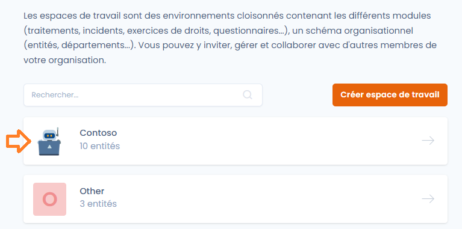
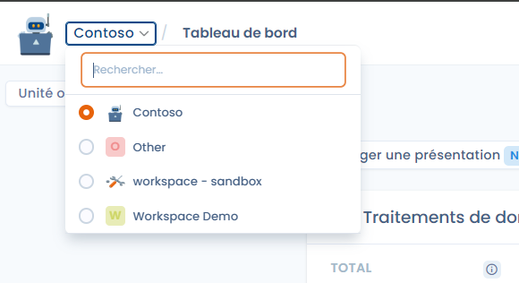
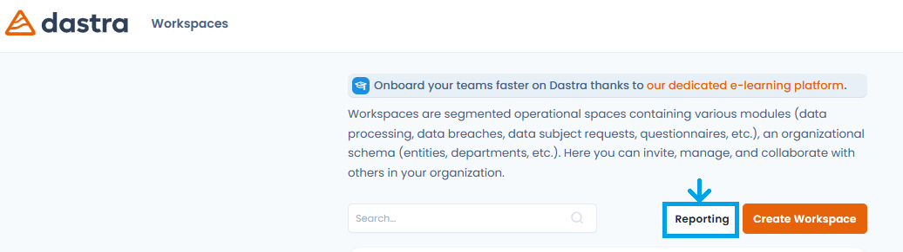
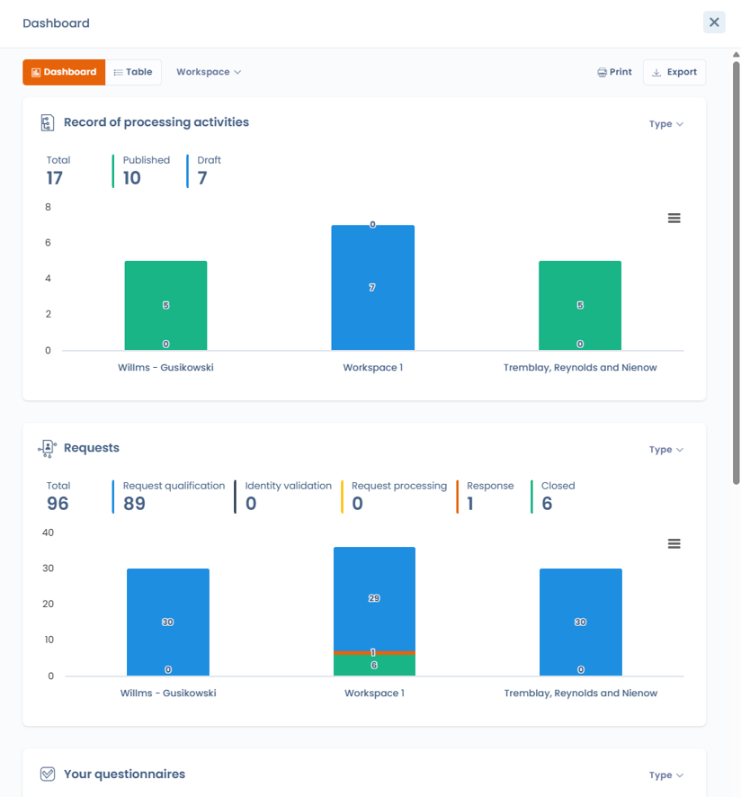
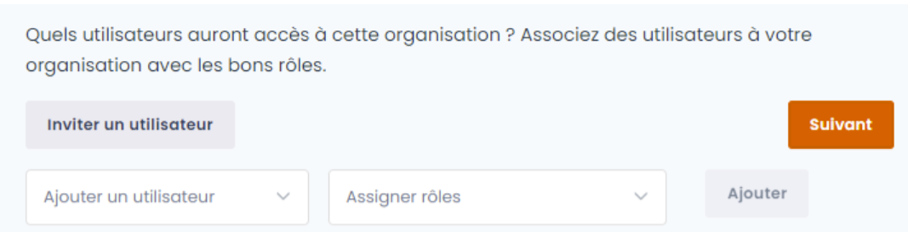
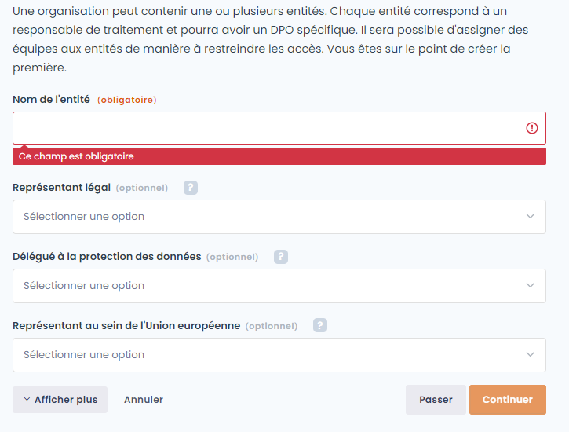
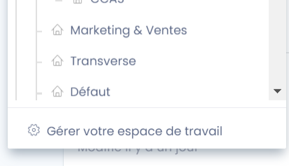
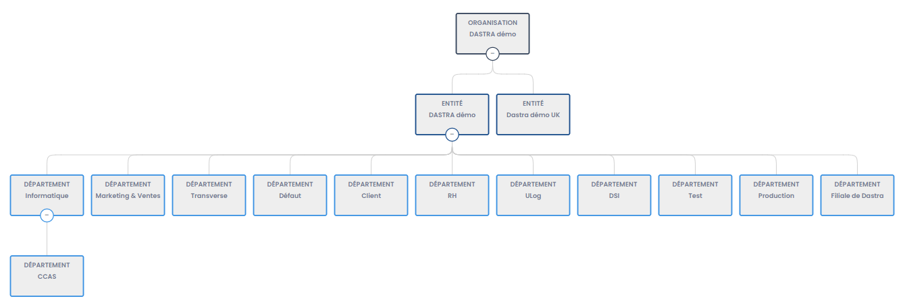

# Créer et paramétrer un espace de travail

## Connectez-vous à Dastra.eu

Commencez par vous connecter à [Dastra.eu](https://www.dastra.eu/). Si vous n'avez pas encore de compte, [inscrivez-vous](https://app.dastra.eu/signup) et créez-en un nouveau.


Vous pouvez accéder immédiatement à Dastra en ouvrant un compte "Essai gratuit" valide sur une période de 30 jours. Si vous souhaitez souscrire à une offre long terme, merci de [nous contacter](https://www.dastra.eu/fr/contact?type=quote).


## Espace de travail

Un espace de travail est **une organisation permettant d'accueillir un ou plusieurs registres des traitements**. Vous pouvez créer un espace de travail par registre de traitement et/ou par entité légale ou succursale, selon votre choix.


Un espace de travail est un environnement dont les **données sont totalement cloisonnées** : les enregistrements d'un espace (traitements, actifs, demandes…) ne sont jamais accessibles depuis le contexte d'un autre espace. Vous pouvez toutefois consulter des **statistiques consolidées** couvrant l'ensemble de vos espaces de travail depuis le tableau de bord inter-espaces (voir « Statistiques inter-espaces de travail »), et dupliquer des éléments (traitements, actifs…) d'un espace à l'autre.


### Créez un espace de travail

1. Cliquez sur **“Nouvel espace de travail”**
2. Remplissez le formulaire (nom, description, logo éventuel)
3. Validez pour lancer la création


Une fois créé, vous pourrez configurer les unités, entités et inviter des utilisateurs.


### Accédez à un espace de travail

Pour accéder à votre espace de travail :

1. **Connectez vous à l'application** avec votre compte utilisateur
2. **Cliquez sur l'espace de travail** dans la liste qui s'affiche :

<figure><figcaption></figcaption></figure>

3. Vous **accédez alors à votre espace de travail**

Vous pouvez basculer à tout moment d'espace de travail en cliquant sur le sélecteur en haut à gauche de l'écran :\

## Statistiques inter-espaces de travail

Le tableau de bord inter-espaces réunit sur une seule vue les indicateurs clés de tous vos espaces de travail. Vous y accédez via le bouton **« Reporting »** depuis la liste de vos espaces de travail.

<figure><figcaption>
Le bouton « Reporting » ouvre le tableau de bord inter-espaces depuis la liste des espaces de travail
</figcaption></figure>

Il consolide les indicateurs des principaux modules : registre des traitements (ROPA), demandes d'exercice de droits, violations de données, questionnaires, systèmes d'IA et tâches. Les données sont présentées sous forme de widgets et de graphiques.

<figure><figcaption>
Indicateurs consolidés du registre des traitements et des demandes d'exercice de droits pour tous les espaces de travail
</figcaption></figure>

Des filtres dynamiques permettent d'affiner l'analyse par espace de travail, par unité organisationnelle et par type. Le tableau de bord peut être imprimé et exporté.

Regardez la vidéo sur la configuration de base de vos espaces de travail :





Renseignez les champs, puis cliquez sur "Continuer".



### Invitez les premiers utilisateurs

Une fois l'espace de travail créé, vous pouvez inviter directement vos collaborateurs dans votre espace.


Vous pouvez ajouter des utilisateurs existants à cet espace ou bien inviter des nouveaux utilisateurs, en cliquant sur le bouton "Inviter un utilisateur".


Assignez-leur le rôle de votre choix et cliquez sur "Suivant".

### Créez la première entité

Dans Dastra, la notion d'espace de travail est décorrélée de celle d'entité juridique. Ainsi, un espace de travail peut faire référence à plusieurs entités juridiques distinctes (comme dans un groupe par exemple). En revanche, il ne peut y avoir qu'un seul représentant légal par entité juridique.

Chaque entité est considérée comme un responsable de traitement.


Attention à bien distinguer les entités des espaces de travail.

Voici un rappel des définitions des termes dans Dastra :

* une **organisation** est le compte lié à votre abonnement. Vous voyez le nom de votre organisation en dessous de votre nom de compte utilisateur (en haut à droite). L'organisation contient un ou plusieurs espaces de travail.
* un **espace de travail** est un environnement technique permettant de collaborer et de travailler avec les fonctionnalités de Dastra. L'espace de travail est représenté par la tuile que vous sélectionnez quand vous vous connectez sur Dastra. Cet espace de travail contient des unités organisationnelles.
* une **unité organisationnelle** est un élément de structure dans l'espace de travail. On peut y attacher des traitements, des tâches, des demandes d'exercice de droits, des violations, des risques. On peut également y associer des droits utilisateurs. Les unités organisationnelles se décomposent entre des entités et des départements.
* une **entité** correspond à un responsable de traitement. Il s'agit d'une entité juridique dont on précise les coordonnées. Un délégué à la protection des données ainsi qu'un responsable peuvent être attaché à cette entité. De la même manière, on peut y attacher une autorité de contrôle chef de file. Cette entité peut être découpée en départements.
* un **département** est une unité organisationnelle positionnée sous une entité. Ce département permet d'organiser l'entité et de répartir les éléments attachés dans différentes branches. Il est possible pour chaque département d'y attacher des départements enfants. Par exemple, les département peuvent être utilisés pour créer l'organigramme de l'entreprise.


Pour créer la première entité juridique, il vous suffit d'indiquer son nom et d'y associer son responsable (le représentant légal) et s'il a été nommé, le délégué à la protection des données ou d'autres acteurs. Seul le nom de l'entité juridique est obligatoire.

Renseignez les champs, puis cliquez sur "Continuer", pour entrer sur votre espace.

### Créer d'autres entités et des départements (optionnel)

Une fois votre espace ouvert, il est une bonne pratique de **renseigner immédiatement l'ensemble des autres entités juridiques ainsi que les départements** éventuels, afin de simplifier par la suite la gestion des traitements et l'attribution des droits aux utilisateurs.

Pour cela, cliquez sur le nom de votre entité en haut à gauche de l'écran (dans ce cas, le bouton "Test") pour afficher le menu déroulant puis, cliquez sur le bouton "Gérer votre espace de travail".

Vous arriverez ainsi dans l'écran de configuration des entités et départements. Créez des départements en cliquant sur le bouton "Créer un département" ou une nouvelle entité juridique en cliquant sur le bouton "Créer une entité (responsable de traitement"), jusqu'à ce que le schéma organisationnel de votre structure soit représenté dans Dastra.


Vous pouvez également rajouter des sous-départements, en cliquant sur le bouton "ajouter un département enfant".


Bravo, votre espace de travail dans Dastra est créé et paramétré !



Suivez le tutoriel ci-dessous ou commencez à explorer Dastra par vous-même.


[tutoriel](../tutoriel/)

