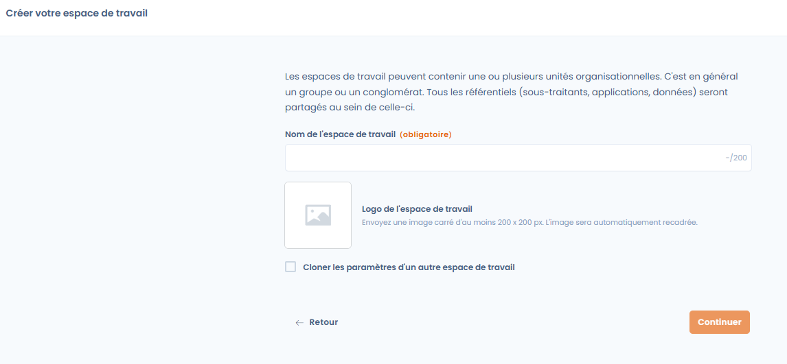

# Mise en place

Cette section vous guide pas à pas pour créer votre premier espace de travail, inviter des utilisateurs et configurer les rôles, permissions et équipes.

***

### 🏁 Démarrer un projet

Commencez par créer votre espace de travail : 

<figure><figcaption></figcaption></figure>


[espace-de-travail.md](espace-de-travail.md)


***

### 👥 Inviter des utilisateurs

Si vous souhaitez rejoindre un projet existant sur Dastra ou inviter un membre de votre équipe, commencez ici : 


[inviter-utilisateurs.md](inviter-utilisateurs.md)


***

### ⚙️ Gérer les rôles et permissions

Apprenez à gérer les rôles et permissions, ou à créer de nouveaux rôles personnalisés selon votre organisation : 


[gerez-les-roles-et-permissions.md](gerez-les-roles-et-permissions.md)


***

### 🧩 Créer et affecter des équipes

Constituez vos équipes et affectez-les aux bons départements ou unités organisationnelles : 


[creer-puis-affectez-des-equipes.md](creer-puis-affectez-des-equipes.md)


***

### 🎓 Tutoriel

Ça y est ! Vous êtes prêt à commencer à utiliser Dastra.\
Vous pouvez explorer librement les fonctionnalités de la plateforme, ou suivre un cas concret à travers le tutoriel suivant : 


[tutoriel](../tutoriel/)


***


💡 **Astuce :** Vous pouvez à tout moment modifier les rôles, équipes et unités organisationnelles dans votre workspace.\
L’ensemble de ces paramètres reste entièrement personnalisable selon votre organisation.

