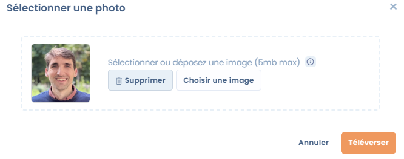
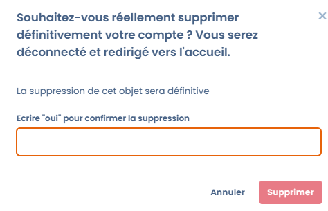

# Paramétrer votre profil utilisateur

### 🧭 Vue d’ensemble

Chaque utilisateur Dastra dispose d’un **profil personnel** contenant ses informations d’identification, ses préférences linguistiques et d’affichage, ainsi que des options liées à la confidentialité du compte.

Cette page explique comment modifier ces informations depuis le menu **Profil utilisateur** accessible via votre avatar en haut à droite de l’écran.

***

### 🖼️ Logo du profil

Vous pouvez ajouter un logo ou une photo de profil visible dans vos espaces de travail et dans vos commentaires.

* **Format :** image carrée d’au moins **200 x 200 px**
* **Formats acceptés :** PNG, JPG ou WebP
* **Recadrage automatique :** Dastra ajuste automatiquement le format carré

<figure><figcaption></figcaption></figure>


Choisissez une image simple et reconnaissable (par exemple, votre photo ou le logo de votre organisation).


***

### 🧾 Informations personnelles

Les champs suivants peuvent être complétés ou mis à jour à tout moment :

| Champ                                                     | Description                                                                | Obligation    |
| --------------------------------------------------------- | -------------------------------------------------------------------------- | ------------- |
| **Prénom**                                                | Votre prénom tel qu’il apparaît dans Dastra                                | ✅ Obligatoire |
| **Nom**                                                   | Votre nom de famille                                                       | ✅ Obligatoire |
| **Pseudonyme public**                                     | Surnom affiché publiquement dans les commentaires ou les partages externes | Optionnel     |
| **Numéro de téléphone**                                   | Utilisé pour certaines notifications ou validations à double facteur       |               |
| **Adresse postale / Code postal / Ville / Région / Pays** | Coordonnées professionnelles ou personnelles selon le contexte             | Optionnel     |
| **Blog / Site web**                                       | Lien vers votre site professionnel ou LinkedIn                             | Optionnel     |
| **Biographie**                                            | Courte description de votre rôle ou fonction                               | Optionnel     |
| **Email du profil**                                       | Adresse associée à votre compte Dastra                                     | ✅ Obligatoire |

### 🌐 Langue et fuseau horaire

Vous pouvez personnaliser l’affichage de Dastra selon votre langue et votre zone horaire.

| Paramètre                 | Description                                                                                            |
| ------------------------- | ------------------------------------------------------------------------------------------------------ |
| **Langue de l’interface** | Langue utilisée dans l’application (Français, Anglais, etc.). Par défaut, 9 langues sont disponibles.  |
| **Fuseau horaire**        | Par défaut, (UTC+01:00) heure d’Europe centrale (Paris)                                                |


Ces préférences influencent uniquement **votre affichage personnel**.\
Elles ne modifient pas la langue par défaut des autres membres du workspace.


***

### ♻️ Réinitialiser les données de préférences

Cette option permet de **remettre à zéro les préférences locales** enregistrées sur votre navigateur.

> Cela supprime :
>
> * les cookies posés par Dastra,
> * les données stockées localement (localStorage),
> * les préférences d’affichage et de colonnes dans les tableaux,
> * les tutoriels “déjà vus” dans les modules.


Cette action est **irréversible** : vos préférences seront perdues, et l’affichage de certains modules sera réinitialisé comme lors de votre première connexion.


***

### 🗑️ Suppression du compte utilisateur

Si vous souhaitez quitter définitivement Dastra, vous pouvez **supprimer votre compte utilisateur**.

> Cette action entraîne :
>
> * La suppression définitive de votre **profil**
> * La perte de vos **droits d’accès** et de vos **équipes associées**
> * L’effacement complet de vos **données personnelles**


Suppression définitive Une fois validée, **la suppression est irréversible**.\
Aucune récupération n’est possible.


<figure><figcaption></figcaption></figure>

***

### 💡 Bonnes pratiques

* Tenez vos coordonnées à jour pour assurer la continuité des communications.
* Utilisez un pseudonyme professionnel si vous pour la communauté Dastra.
* Avant de supprimer votre compte, informez votre administrateur pour éviter toute perte de données.&#x20;

***

### 🔗 Voir aussi

* [Paramétrer vos notifications](../../features/settings/notifications.md)
* [Configurer les rôles et permissions](../../features/settings/roles-et-permissions.md)
* Se connecter et gérer l’authentification
