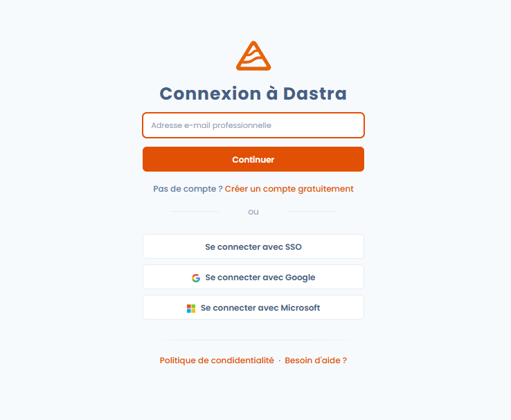
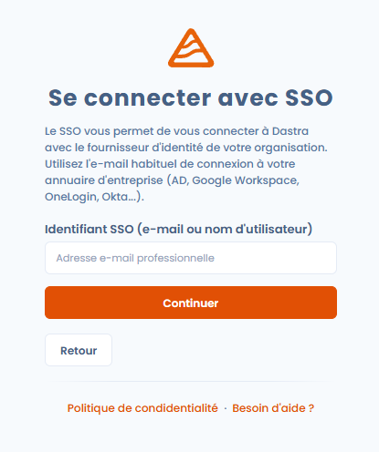
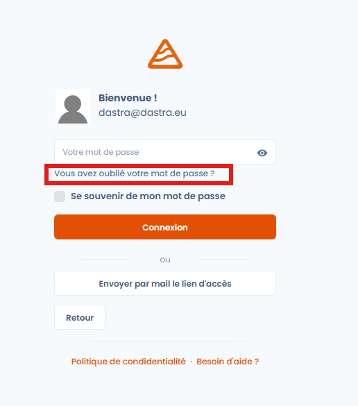
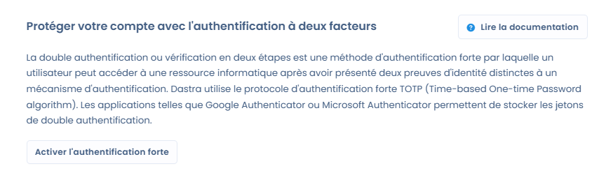

# Se connecter et gérer l’authentification

### 🧭 Vue d’ensemble

L’accès à Dastra est sécurisé par un système d’authentification conforme aux meilleures pratiques de protection des données.\
Vous pouvez vous connecter avec vos identifiants Dastra, un compte tiers (SSO), et renforcer la sécurité de votre compte grâce à la **double authentification (2FA)**.

***

### 🚪 Se connecter à Dastra

#### 🔑 Via identifiants Dastra

1. Rendez-vous sur [https://app.dastra.eu](https://app.dastra.eu)
2. Saisissez votre **adresse e-mail** et **mot de passe**
3. Cliquez sur **Se connecter**

<figure><figcaption></figcaption></figure>


Cochez l’option **Se souvenir de mon mot de passe** si vous utilisez un appareil personnel pour éviter de ressaisir vos identifiants à chaque visite.


***

#### 🌐 Via un fournisseur d’identité (SSO)

Si votre organisation a configuré un **SSO (Single Sign-On)**, vous pouvez vous connecter via votre fournisseur d’identité (par ex. Microsoft, Google, Okta…).

1. Sur la page de connexion, cliquez sur **Se connecter avec SSO**
2. Entrez votre adresse email
3. Suivez la procédure d’authentification propre à votre organisation
4. Vous serez automatiquement redirigé vers votre espace Dastra

<figure><figcaption></figcaption></figure>



Le SSO simplifie la gestion des accès et renforce la sécurité : vos identifiants ne sont jamais partagés avec Dastra.


***

### 🔄 Réinitialiser votre mot de passe

En cas d’oubli de votre mot de passe :

1. Cliquez sur **Mot de passe oublié ?** sur la page de connexion
2. Entrez votre adresse e-mail associée à votre compte
3. Consultez votre boîte mail et suivez le lien de réinitialisation
4. Choisissez un nouveau mot de passe conforme aux critères de sécurité

<figure><figcaption></figcaption></figure>


Les liens de réinitialisation expirent après un court délai pour des raisons de sécurité.\
Si le lien ne fonctionne plus, recommencez la procédure.


***

### 🔒 Activer la double authentification (2FA)

La **double authentification** renforce la sécurité de votre compte Dastra.\
Elle ajoute une étape supplémentaire lors de la connexion : la saisie d’un **code unique généré sur votre téléphone**.

#### ⚙️ Activation

1. Accédez à votre **profil utilisateur → Sécurité du compte**
2. Cliquez sur **Activer la double authentification**
3. Scannez le QR code avec une application d’authentification (Google Authenticator, Authy, 1Password, etc.)
4. Entrez le code généré pour confirmer l’activation

<figure><figcaption></figcaption></figure>


Conservez le **code de récupération** affiché lors de l’activation.\
Il vous permettra de regagner l’accès à votre compte si vous perdez votre appareil.


En savoir plus sur [l'authentification forte](../../security/mfa.md).

***

### 📱 Connexion avec 2FA activée

Une fois la 2FA activée, la connexion se déroule en deux étapes :

1. Saisissez votre **identifiant et mot de passe**
2. Entrez le **code de validation à 6 chiffres** généré par votre application d’authentification


Bon à savoir Le code 2FA change toutes les 30 secondes et ne peut être utilisé qu’une seule fois.


***

### 🧹 Gérer les sessions actives

Dastra vous permet de consulter et de fermer les **sessions actives** associées à votre compte.

1. Accédez à **Profil → Sécurité du compte → Sessions actives**
2. Consultez la liste des appareils et navigateurs connectés
3. Cliquez sur **Supprimer** pour déconnecter un appareil spécifique


Fermez toute session inconnue immédiatement pour éviter un accès non autorisé à vos données.


***

### 🧰 Bonnes pratiques de sécurité

* Utilisez un **mot de passe unique et robuste** (au moins 12 caractères, avec majuscules, minuscules, chiffres et symboles).
* Ne partagez jamais vos identifiants, même en interne.
* Activez la **double authentification** sur tous vos comptes professionnels.
* Fermez votre session sur les appareils partagés ou publics.
* Vérifiez régulièrement vos sessions actives.

***

### 🔗 Voir aussi

* [Paramétrer votre profil utilisateur](parametrer-votre-profil-utilisateur.md)
* [Configurer les notifications](../../features/settings/notifications.md)
* [Politique de sécurité et confidentialité de Dastra](../../security/general.md)
