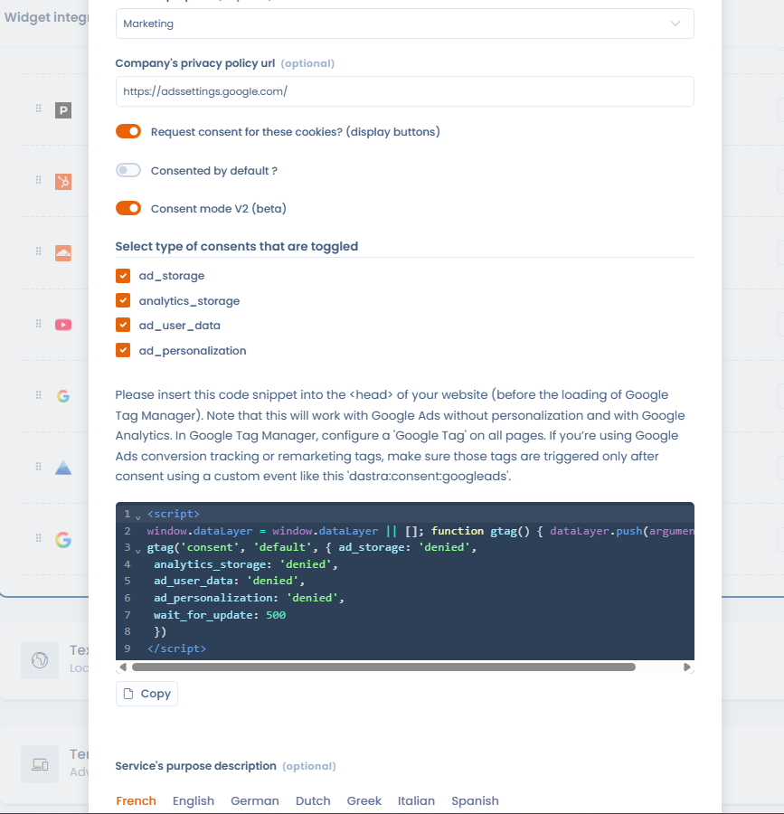

# Google Consent Mode V2

Dastra ondersteunt **Google Consent Mode V2** standaard. Deze integratie stuurt een `consent_update`-signaal naar Google Tag Manager (GTM) zodra een gebruiker toestemming geeft, zodat de Google-tags deze keuze respecteren voordat er tracking wordt gestart.

## Vereisten

* Het standaard toestemmingsfragment (zie stap 2) moet in de `<head>` van uw website worden geplaatst, **vóór** het laden van Google Tag Manager.
* Configureer in Google Tag Manager een **"Google Tag"** die op alle pagina's wordt geactiveerd.
* De integratie werkt met **Google Ads** (zonder personalisatie) en **Google Analytics**.
* Als u Google Ads-tags voor conversietracking of remarketing gebruikt, zorg er dan voor dat deze tags alleen na toestemming worden geactiveerd, met behulp van een aangepaste gebeurtenis zoals `dastra:consent:{service-slug}` (voorbeeld: `dastra:consent:googleleads`).

## Stap 1 — Consent Mode V2 activeren voor de service

Bewerk in de widgetintegratie de betreffende service (bijv. Google Analytics, Google Ads) en activeer de schakelaar **"Consent mode V2"**. Eenmaal geactiveerd, stuurt de Dastra-banner automatisch het `consent_update`-signaal naar GTM telkens wanneer een gebruiker met de toestemmingsbanner interageert.

Selecteer vervolgens de **toestemmingstypen** die voor deze service worden aangestuurd (standaard allemaal aangevinkt):

* `ad_storage`
* `analytics_storage`
* `ad_user_data`
* `ad_personalization`

<figure><figcaption><p>Consent Mode V2 activeren voor een service van de cookiewidget</p></figcaption></figure>

Het standaard toestemmingsfragment dat u in uw website moet plaatsen, wordt rechtstreeks in de interface weergegeven: gebruik de knop **Kopiëren** om het over te nemen en volg daarna stap 2.

## Stap 2 — De standaard toestemmingscode vóór GTM plaatsen

Om ervoor te zorgen dat de Google-tags op het toestemmingssignaal wachten voordat ze worden geactiveerd, plaatst u het volgende fragment **vóór** de GTM-initialisatiecode op uw pagina:

```html
<script>
  window.dataLayer = window.dataLayer || [];
  function gtag() { dataLayer.push(arguments) }
  gtag('consent', 'default', {
    ad_storage: 'denied',
    analytics_storage: 'denied',
    ad_user_data: 'denied',
    ad_personalization: 'denied',
    wait_for_update: 500
  });
</script>
```

Dit fragment geeft de Google-tags de instructie om maximaal 500 ms te wachten op het `consent_update`-signaal voordat de tracking wordt uitgevoerd. Als de gebruiker de betreffende services accepteert, activeert de Dastra-banner dit signaal automatisch en kunnen de tags worden uitgevoerd.


Dit fragment moet **vóór** de GTM-initialisatie worden geplaatst. Als het erna wordt geladen, kunnen de Google-tags worden geactiveerd zonder op toestemming te wachten.


## Verder gaan

Voor het activeren van tags op basis van toestemmingen (dataLayer-gebeurtenissen, blocking triggers...), zie de pagina over Google Tag Manager:


[google-tag-manager.md](google-tag-manager.md)

