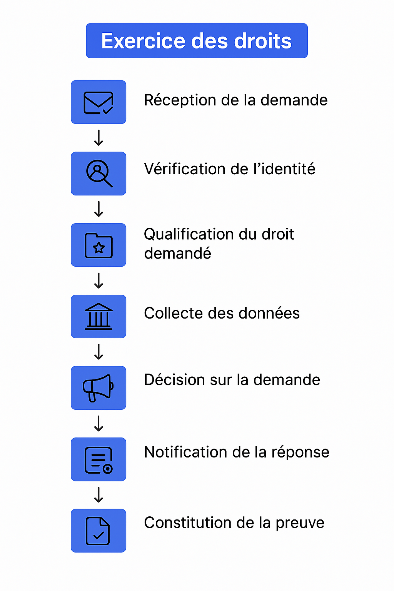

# Droits des personnes

Le RGPD réaffirme les droits des individus, introduit la **portabilité** et renforce les obligations du **responsable du traitement** (RT).\
Les personnes doivent **garder le contrôle** de leurs données, et le RT doit **expliquer clairement** comment exercer ces droits.

* **Délai de réponse** : 1 mois à compter de la réception (prolongeable **2 mois** pour demandes complexes ou nombreuses — notifier la prolongation dans le mois).
* **Gratuit** : pas de frais, sauf demandes manifestement **infondées** ou **excessives** (motiver alors le refus ou facturer des frais raisonnables).
* **Traçabilité** : consigner les demandes et réponses (preuve de conformité).

***

### ✅ Deux obligations majeures du responsable de traitement

1. **Informer** les personnes (finalités, bases légales, durées, destinataires, droits, transferts, contact DPO, etc.).
2. **Notifier l’exécution** d’opérations conformes à l’exercice des droits (rectification, effacement, limitation) ou **motiver** un refus.

***

### 🧭 Règles opérationnelles communes (tous droits)

* **Délai** : 1 mois (jusqu’à +2 mois si nécessaire, avec information sous 1 mois).
* **Vérification d’identité** proportionnée au risque (éviter d’exiger plus que nécessaire).
* **Canaux d’entrée** : email dédié, formulaire, portail en ligne, courrier.
* **Journalisation** : date de réception, identité vérifiée, périmètre, décision, date de clôture.
* **Exemptions / limites** : droits des tiers, secrets d’affaires, obligations légales de conservation, sécurité, prévention des fraudes… (documenter).

***

### 📜 Droit à l’information (Arts. 13 & 14)

À fournir **au moment de la collecte** (directe) ou **sous 1 mois** (indirecte) : identité du RT, finalités, bases légales, destinataires, transferts, durées, droits, contact DPO, source (si indirect), décision automatisée/profilage le cas échéant.

> Support : mentions sur formulaire, politique de confidentialité, bandeau cookies, affichage (vidéosurveillance), scripts de centre d’appels, etc.

***

### 🔎 Droit d’accès (Art. 15)

La personne peut obtenir :

* la **confirmation** que des données sont traitées,
* **l’accès** aux données et informations associées (finalités, catégories, destinataires, durées…),
* une **copie** des données (gratuite pour la première copie).

**Modalités** :

* **Écrit** (postal ou email), **sur place** (si adapté), ou **en ligne** (espace sécurisé).
* Les réponses doivent être **compréhensibles** (explication des codes, acronymes, scores).

**Limites / refus** : demandes abusives, atteinte aux droits de tiers, absence de données → répondre quand même pour le signifier.

***

### 🧯 Droit de rectification (Art. 16)

Corriger sans délai les **données inexactes** et compléter les **données incomplètes** (via déclaration complémentaire).\
Informer, le cas échéant, les destinataires des rectifications.

***

### 🗑️ Droit à l’effacement (Art. 17)

Effacer les données lorsque :

* elles ne sont plus nécessaires,
* retrait du consentement,
* opposition fondée et pas de motif impérieux,
* traitement illicite,
* obligation légale d’effacement,
* données collectées auprès d’enfants (services de la société de l’information).

**Exceptions** : obligation légale de conservation, exercice/défense de droits en justice, intérêt public (santé, recherche), liberté d’expression et d’information.\
Informer les destinataires lorsque c’est applicable.

***

### 🚦 Droit à la limitation (Art. 18)

Suspendre temporairement le traitement (hors conservation) si :

* exactitude contestée,
* traitement illicite (la personne demande la limitation plutôt que l’effacement),
* données nécessaires à **l’exercice/défense de droits**,
* vérification d’une opposition en cours.

***

### 🔁 Droit d’opposition (Art. 21)

La personne peut s’opposer :

* **à tout moment** au marketing direct (y compris profilage lié au marketing) → **obligation de cesser** sans délai ;
* pour des raisons tenant à sa situation particulière, à un traitement fondé sur l’**intérêt légitime** → accepter si aucun motif légitime impérieux contraire.

> Prévoir des **mécanismes simples** d’opt-out (lien en bas d’email, préférence compte, case à cocher…).

***

### 📦 Droit à la portabilité (Art. 20)

* Recevoir les **données fournies** au RT **dans un format structuré, couramment utilisé et lisible par machine**,
* et les **transmettre à un autre RT** (lorsque techniquement possible).\
  S’applique lorsque le traitement est fondé sur le **consentement** ou le **contrat** et réalisé **par moyens automatisés**.

***

### 🤖 Décision individuelle automatisée & profilage (Art. 22)

Droit **de ne pas faire l’objet** d’une décision **entièrement automatisée** produisant **des effets juridiques** ou similaires significatifs (exclusion : contrat nécessaire, autorisation légale, consentement explicite — sous **garanties**).\
Obligations : **information claire**, **intervention humaine**, **possibilité de contester** et d’exprimer son point de vue.

***

### 🧪 Consentement (Arts. 6, 7)

Le consentement doit être **libre, spécifique, éclairé et univoque** (action positive, **non pré-coché**).\
Retrait **aussi facile que l’octroi**.\
Exemples : données sensibles, prospection électronique, cookies (selon finalités).

***

### 🧰 Playbook opérationnel (modèle)

#### Canaux d’entrée

* Formulaire web (authentifié si possible), email dédié (privacy@…), portail client, courrier.

#### Vérification d’identité

* Proportionnée (email de confirmation, code à usage unique, pièce si risque avéré).
* Éviter d’augmenter le risque (ne pas demander plus que nécessaire).

#### SLA & workflow

1. **Accusé de réception** (72h) avec N° de dossier et délai cible,
2. **Qualification** du droit demandé et périmètre (systèmes, filiales, sous-traitants),
3. **Collecte** et revue interne (métier/IT/juridique/DPO),
4. **Réponse** dans le mois (+ notification si prolongation),
5. **Preuve** : consigner pièces et décision, notifier les destinataires concernés (rectif/effacement/limitation).

#### Preuves à conserver

* Demande, identité vérifiée, recherches effectuées, décision motivée, date d’envoi, logs de notification, éléments transmis à la personne.

***

### 🧩 Gérer les droits dans Dastra

* **Collecte & suivi** : créez un dossier DSR, assignez, fixez l’échéance, suivez le statut (en attente d’infos, en traitement, clôturé).
* **Vérification & preuve** : journalisez identités, recherches et décisions ; stockez pièces justificatives dans la **GED**.
* **Automatisation** : modèles de réponses, tâches récurrentes, rappels, notifications, intégrations (helpdesk/CRM).
* **Reporting** : temps de réponse, volumétrie, motifs de refus, tendances par droit.

<figure><figcaption></figcaption></figure>

***

### 🧭 Modèles de réponses (exemples rapides)

* **Accusé de réception** :\
  « Nous avons bien reçu votre demande le JJ/MM/AAAA. Elle porte sur le droit d’\_\_\_\_\_\_. Nous y répondrons au plus tard le JJ/MM/AAAA. »
* **Prolongation** :\
  « Compte tenu de la complexité/du nombre de demandes, le délai est prolongé de deux mois. Vous recevrez une réponse au plus tard le JJ/MM/AAAA. »
* **Refus motivé** :\
  « Votre demande ne peut être satisfaite car \_\_\_\_\_\_ (motif RGPD). Vous pouvez introduire une réclamation auprès de l’autorité compétente. »

***

### 📌 À retenir

* Délai **1 mois** (jusqu’à +2), **gratuit** sauf abus, **traçabilité** obligatoire.
* Mettre en place des **processus et preuves** standardisés.
* Prévoir des **mécanismes simples** d’opt-out et de portabilité.
* Centraliser le traitement des demandes dans **Dastra** pour sécuriser, prouver et piloter.
